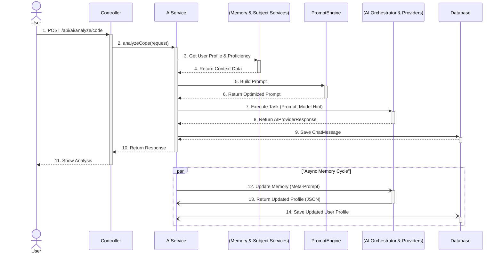

# Whitepaper da Arquitetura de IA do MindForge

## 1. Filosofia e Decisões Arquiteturais Chave

A arquitetura de IA do MindForge é fundamentada na **orquestração inteligente** em vez da dependência de um único modelo de linguagem. As seguintes decisões de design foram cruciais para alcançar um sistema flexível, contextual e robusto.

### Decisão 1: Orquestração em Java vs. Microserviço em Python
-   **Escolha:** Manter a lógica de IA dentro do monólito modular Java/Spring Boot.
-   **Justificativa:** Para o estágio atual do projeto, a complexidade de gerenciar um microserviço separado (deployment, comunicação inter-serviços, latência de rede) superaria os benefícios. A orquestração em Java simplifica a infraestrutura e permite que a lógica de IA acesse diretamente os serviços de domínio e o banco de dados para coletar contexto, resultando em menor latência e maior coesão de dados.
-   **Trade-off:** Abre-se mão do acesso direto ao ecossistema de bibliotecas de IA do Python (ex: LangChain, LlamaIndex). Este trade-off é mitigado pela implementação de padrões de design sólidos em Java que replicam a funcionalidade necessária.

### Decisão 2: Padrão Strategy para Provedores de IA (`AIProvider`)
-   **Escolha:** Abstrair a comunicação com as APIs de IA através da interface `AIProvider`.
-   **Justificativa:** Evita o acoplamento forte com um fornecedor específico (ex: Google, Groq). Isso torna o sistema **agnóstico ao provedor**, permitindo:
    1.  **Flexibilidade:** Trocar ou adicionar novos modelos de IA (ex: Anthropic, OpenAI) com impacto mínimo, implementando apenas uma nova classe `Provider`.
    2.  **Otimização:** Usar diferentes provedores para diferentes tarefas (ex: Gemini para multimodalidade, Groq para baixa latência), otimizando custo e performance.
-   **Trade-off:** Adiciona uma camada de abstração que, embora pequena, aumenta a complexidade inicial do código.

### Decisão 3: Ciclo de Memória Assíncrono
-   **Escolha:** Executar a lógica de atualização da memória da IA (`MemoryService`) em uma thread separada (`@Async`).
-   **Justificativa:** A experiência do usuário não deve ser penalizada pela "inteligência" do sistema. A resposta à requisição principal do usuário é retornada com a menor latência possível. O processo de "aprendizado" da IA, que envolve uma chamada extra à API, ocorre em background, sem bloquear a thread principal.
-   **Trade-off:** A memória não é atualizada em tempo real, o que significa que o aprendizado de uma interação só estará disponível para a *próxima* requisição. Para o caso de uso de um mentor, essa consistência eventual é perfeitamente aceitável.

---

## 2. Arquitetura Dinâmica: A Anatomia de uma Requisição

O diagrama abaixo detalha o fluxo completo de uma requisição de análise de código, ilustrando a colaboração entre os componentes.

---

## 3. Deep Dive: O Ciclo de Memória Assíncrono

O ciclo de memória é o que permite à IA evoluir de uma ferramenta de pergunta-resposta para um mentor que aprende. O diagrama abaixo foca exclusivamente neste processo.

-   **O Meta-Prompt:** A chave para este ciclo é o "prompt sobre o prompt". É uma instrução para a IA analisar a interação e seu próprio estado anterior para gerar um novo estado.
    > **Exemplo de Meta-Prompt:** `"Analise a conversa a seguir e o perfil JSON existente. O usuário demonstrou entendimento de 'SOLID' mas dificuldade com 'Java Streams'. Retorne um NOVO perfil JSON atualizado com esses aprendizados. Mantenha o formato JSON."`
-   **Impacto:** Este mecanismo cria um ciclo de feedback positivo, onde a IA se torna progressivamente mais ciente do contexto do usuário, resultando em interações futuras mais ricas e personalizadas.

---

## 4. Resiliência e Tratamento de Falhas

Um sistema que depende de serviços de rede externos deve ser inerentemente resiliente. A arquitetura do MindForge incorpora múltiplos padrões de resiliência, principalmente na camada de `AIProvider`, utilizando a biblioteca **Resilience4j**.

-   **Circuit Breaker:** Cada implementação de `AIProvider` (ex: `GroqProvider`) é anotada com `@CircuitBreaker`. Se um provedor de IA começar a falhar repetidamente (ex: API fora do ar), o circuito "abre" e as chamadas subsequentes falham imediatamente, sem sequer tentar a conexão de rede. Isso previne que a aplicação gaste recursos em um serviço sabidamente indisponível. Após um tempo, o circuito tenta fechar com uma chamada de teste.
-   **Retry:** A anotação `@Retry` permite que uma chamada falha seja automaticamente tentada novamente algumas vezes. Isso é útil para falhas transitórias de rede. Se a primeira chamada falhar, o sistema espera um intervalo configurado e tenta de novo, até um número máximo de tentativas.
-   **Rate Limiter:** A anotação `@RateLimiter` controla o número de chamadas por segundo que podem ser feitas para a API externa. Isso é crucial para não exceder os limites de uso impostos pelos provedores de IA e evitar custos inesperados ou bloqueios de API.
-   **Time Limiter:** A anotação `@TimeLimiter` define um tempo máximo de espera para a resposta da API. Se a API demorar mais do que o esperado para responder, a chamada é interrompida. Isso evita que threads fiquem presas indefinidamente, aguardando uma resposta que pode nunca chegar.
-   **Fallback de Orquestração:** Além da resiliência a nível de chamada, o `GroqOrchestratorService` implementa um fallback a nível de negócio. Se a chamada ao modelo primário (`VERSATILE`) falhar por qualquer motivo (incluindo um circuito aberto), a lógica de orquestração captura a falha e dispara uma nova chamada para o modelo secundário (`INSTANT`), garantindo a continuidade do serviço para o usuário.

## 5. Conclusão

A arquitetura de IA do MindForge é um exemplo de como a engenharia de software pragmática pode ser usada para construir sistemas inteligentes, robustos e manuteníveis. As decisões de design, como a orquestração em Java, o padrão Strategy, o ciclo de memória assíncrono e a implementação de múltiplos padrões de resiliência, resultam em um sistema que é muito mais do que um simples cliente de API. É uma plataforma que agrega valor real ao transformar modelos de linguagem genéricos em ferramentas de aprendizado contextuais e personalizadas, com a flexibilidade de evoluir e se adaptar ao futuro do cenário de IA.
