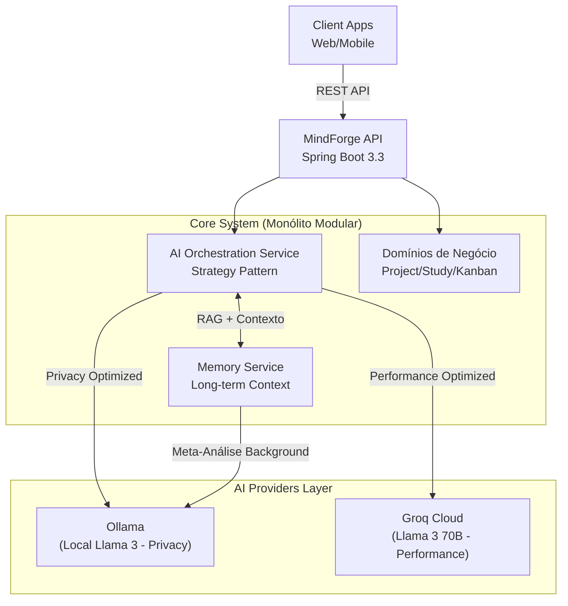

<p align="center">
  
</p>

# MindForge API - Enterprise AI Orchestration Platform


> **Uma plataforma de orquestração de IA de nível corporativo projetada para transformar modelos de linguagem em mentores contextuais especializados.**

---

## 🚀 Visão do Produto

O **MindForge** não é apenas uma API; é uma demonstração de **engenharia de software moderna** aplicada à Inteligência Artificial. Projetado para atuar como um "segundo cérebro", o sistema centraliza gestão de conhecimento e produtividade, utilizando arquitetura **Domain-Driven Design (DDD)** para orquestrar múltiplos provedores de IA (Ollama Local e Groq Cloud) em uma experiência unificada e coesa.

O diferencial técnico reside na **capacidade de manter o contexto** (stateful conversation memory) e na **especialização dinâmica de agentes**, permitindo que LLMs genéricos atuem como especialistas em domínios específicos (Mentoria, Análise de Código, Recrutamento Técnico) com alta precisão.

> [!IMPORTANT]
> **Deployment & Infraestrutura**: O MindForge foi arquitetado para ser *SaaS-Ready*, suportando múltiplos inquilinos de forma isolada. Atualmente, a aplicação é executada localmente para tirar proveito da integração nativa com **LLMs locais (via Ollama)**. Esta escolha técnica garante máxima resiliência, latência reduzida para RAG e total privacidade dos dados, superando as limitações rídicas de recursos encontradas em plataformas *free-tier* convencionais. A transição para um ambiente de nuvem escalável é o próximo passo natural do roadmap.

---

## 🏗️ Visão Arquitetural



---

## 📐 Destaques de Arquitetura & Engenharia

### 🏗️ Design Arquitetural: Monólito Modular
Adotamos uma abordagem de **Monólito Modular** para combinar a simplicidade operacional de um monólito com a separação de responsabilidades de microserviços.
- **Boundaries Claros**: Cada domínio (`Project`, `Study`, `AI`) possui seus próprios contextos, repositórios e serviços, proibindo acoplamento direto.
- **Scalability-Ready**: A estrutura permite a extração futura de módulos (ex: o serviço de orquestração de IA) para microserviços independentes sem refatoração massiva.

### 🧠 Orquestração de IA & Strategy Pattern
O núcleo de IA utiliza o **Strategy Pattern** para abstrair a complexidade dos provedores:
- **Provider Agnostic**: O sistema pode alternar dinamicamente entre `OllamaProvider` e `GroqProvider` (para modelos Llama 3/Mixtral) baseado em disponibilidade, custo ou especialização.
- **Resiliência Adaptativa**: Implementação de **Circuit Breakers** e **Retries** inteligentes via Resilience4j garantem que falhas em um provedor de IA não derrubem a aplicação.

### ⚡ Performance & Java 21
A escolha pelo **Java 21** não foi acidental:
- **Virtual Threads**: Preparado para alta concorrência em operações de I/O intensivas (chamadas a LLMs).
- **Records**: Modelagem de dados imutáveis para DTOs e eventos de domínio.
- **Pattern Matching**: Lógica de negócios expressiva e menos propensa a erros.

### 🏢 Arquitetura Multi-Tenant
Suporte nativo a SaaS B2B com **Multi-Inquilino (Multi-Tenancy)**:
- **Shared Database, Shared Schema**: Isolamento lógico de dados via Discriminator Column (`tenant_id`).
- **Resolução Automática**: Um filtro de segurança resolve o tenant via JWT e o injeta no contexto da thread (`ThreadLocal`).
- **Segurança Transparente**: Entity Listeners garantem que todo dado persistido pertença ao inquilino correto, evitando vazamento de dados.

---

## 🛠️ Tech Stack & Decisões Técnicas

| Categoria | Tecnologia | Justificativa da Escolha |
|-----------|------------|--------------------------|
| **Core** | **Java 21 LTS** | Robustez, tipagem forte e novos recursos de concorrência. |
| **Framework** | **Spring Boot 3.3** | Produtividade, injeção de dependência e ecossistema maduro. |
| **Data** | **PostgreSQL 15+** | Confiabilidade ACID e suporte a consultas complexas JSONB. |
| **ORM** | **Hibernate / JPA** | Abstração de persistência com otimizações de cache de primeiro nível. |
| **AI Orchestration** | **Factory, Strategy, Facade, Command, Chain** | Padrões de design robustos para gerenciar múltiplos provedores e complexidade. |
| **Multi-Tenancy** | **Discriminator / Filter** | Suporte SaaS com isolamento lógico e resolução via JWT. |
| **AI Providers** | **Groq (Cloud) E Ollama (Local)** | Equilíbrio entre performance (Groq Llama-70B) e privacidade (Ollama Llama-3). |
| **Web Research** | **Tavily AI** | Pesquisa na web em tempo real para "Grounding" e redução de alucinações. |
| **AI Concepts** | **RAG, Chain-of-Thought, Agents** | Implementação proprietária de conceitos avançados de LLM. |
| **Resilience** | **Resilience4j** | Tolerância a falhas (Circuit Breaker, Retry) para APIs instáveis. |
| **Doc** | **OpenAPI (Swagger)** | Documentação viva e testável dos endpoints REST. |
---

## 🧩 Funcionalidades Principais (Product Features)

### 📚 Ecossistema de Aprendizado Inteligente
- **Roadmaps de Estudo Dinâmicos**: A IA gera cronogramas semanais personalizados com tópicos e recursos curados da web (vídeos, documentação oficial) baseados no seu nível.
- **Mapas Mentais Interativos**: Visualize conexões complexas entre conceitos. Transforme anotações em diagramas dinâmicos para facilitar a retenção.
- **Geração de Quizzes com IA**: Teste seus conhecimentos com quizzes gerados automaticamente a partir de suas próprias notas e conteúdos atualizados da internet.
- **Gestão de Sessões de Estudo**: Rastreie seu tempo e progresso com um timer integrado e registro automático de métricas de proficiência.

### 💻 Orquestração de IA & Produtividade
- **Mentoria com Memória Contextual (RAG)**: Um assistente que aprende com você. Utilizando *Retrieval-Augmented Generation*, a IA acessa seu histórico e notas para dar respostas precisas e personalizadas.
- **Agente de Edição Colaborativa**: Solicite melhorias em seus documentos e visualize as mudanças via **JSON Diffs**. Aceite ou rejeite sugestões da IA com um clique.
- **Análise de Documentos & OCR**: Faça upload de PDFs, imagens ou DOCX. O sistema transcreve conteúdos (OCR) e analisa documentos extensos usando a técnica **Map-Reduce** para garantir precisão em arquivos grandes.
- **Multi-Provedor Inteligente**: Seleção dinâmica entre **Ollama (Local/Privacidade)** e **Groq (Nuvem/Alta Velocidade)**, garantindo resiliência e o melhor custo-benefício.

### 🛠️ Gestão de Engenharia & Software
- **Integração Profunda com GitHub**: Conecte repositórios, navegue na árvore de arquivos e solicite análises de código de arquivos específicos com personas de *Senior Architect* ou *Tech Recruiter*.
- **Tomada de Decisão Estratégica**: Registre e proponha decisões técnicas fundamentadas. O sistema ajuda a pesar trade-offs e mantém um registro histórico do porquê de cada escolha arquitetural.
- **Quadros Kanban Evoluídos**: Organize tarefas de estudo e código em fluxos visuais. Vincule tarefas a assuntos específicos para manter a rastreabilidade total.
- **Workspaces Isolados**: Separe contextos de vida acadêmica, profissional e pessoal em espaços dedicados, mantendo a organização em nível corporativo.

### 🏢 Plataforma SaaS Ready
- **Arquitetura Multi-Tenant**: Isolamento lógico robusto de dados, permitindo que múltiplos usuários ou empresas utilizem a plataforma de forma segura e independente no mesmo banco de dados.

---

## � Infraestrutura e Setup

> **Para Recrutadores e Desenvolvedores:**  
> Toda a configuração de infraestrutura, scripts de automação, exemplos e Dockerfiles foram organizados na pasta [`setup/`](./setup/).
> Lá você encontrará:
> - **[INFRA_EXPLANATION.md](./setup/INFRA_EXPLANATION.md)**: Explicação detalhada da infraestrutura.
> - **Makefile**: Comandos rápidos para rodar o projeto.
> - **Docker Hub**: Configuração completa dos containers.
> - **Scripts de IA**: Automação para setup do Ollama.

---

## �🚀 Início Rápido (Quick Start)

### Passo 1: Clone o Repositório
```bash
git clone https://github.com/matheus05dev/mindforge-api.git
cd mindforge-api
```

### Opção 1: Modo Desenvolvimento (Recomendado)

Rode a infraestrutura no Docker (DB + Ollama) e a API na sua IDE/Local.

```bash
# 1. Entre na pasta de setup
cd setup

# 2. Inicie o Banco de Dados e Ollama
make dev

# 3. Baixe os modelos de IA (apenas na primeira vez)
make setup-ai

# 4. Volte para a raiz e rode a API
cd ..
./mvnw spring-boot:run

# Acesso
# API: http://localhost:8080
# Swagger: http://localhost:8080/swagger-ui.html
```

### Opção 2: Stack Completo no Docker

Rode tudo (Banco, Ollama e API) dentro de containers.

```bash
# 1. Entre na pasta de setup
cd setup

# 2. Inicie todos os serviços
make up

# 3. Baixe os modelos de IA (apenas na primeira vez)
make setup-ai

# Acesso
# API: http://localhost:8080
# Swagger: http://localhost:8080/swagger-ui.html
```

### Opção 3: Setup Manual (Sem Docker)

```bash
# 1. Instale PostgreSQL 15+ com pgvector
createdb mindforge
psql mindforge -c "CREATE EXTENSION vector;"

# 2. (Opcional) Instale Ollama
# Baixe em: https://ollama.ai
ollama pull nomic-embed-text
ollama pull llama3.1:8b

# 3. Configure application.properties
# O arquivo src/main/resources/application.properties já está configurado para dev local
# Ajuste user/pass do banco se necessário

# 4. Rode a aplicação
./mvnw spring-boot:run
```

## 📦 Comandos Disponíveis (make)
> **Nota:** Execute estes comandos dentro da pasta `setup/`

```bash
cd setup
make dev       # Inicia DB + Ollama (dev local)
make up        # Inicia todos os serviços
make down      # Para os serviços
make clean     # Remove tudo (containers + volumes)
make logs      # Vê os logs
make test      # Roda os testes (usa wrapper na raiz)
make setup-ai  # Baixa modelos do Ollama
```

## 🔧 Configuração

### Variáveis de Ambiente

O projeto usa `src/main/resources/application-docker.properties` para o ambiente Docker, que é mapeado automaticamente pelo profile.

Para customizar credenciais ou chaves de API, você pode criar variáveis de ambiente no seu sistema ou editar os arquivos.

**Principais Variáveis:**
- `POSTGRES_USER` (Padrão: mindforge_user)
- `POSTGRES_PASSWORD` (Padrão: mindforge_pass)
- `GROQ_API_KEY` (Opcional, para usar Groq Cloud)

### Provedores de IA

Para mudar o provedor de IA (Ollama vs Groq), edite o `application.properties` ou injete a variável `AI_PROVIDER`.

## 🧪 Testes & Qualidade

O projeto mantém um rigoroso padrão de qualidade com testes automatizados cobrindo serviços, controladores e utilitários.

```bash
# Rodar todos os testes
./mvnw test

# Com relatório de cobertura (Jacoco)
./mvnw test jacoco:report
# Ver relatório: open target/site/jacoco/index.html
```

> [!NOTE]
> **Status Atual**: 129 testes passando com sucesso. A cobertura inclui validação de multi-tenancy, orquestração de IA, segurança e lógica de domínio.

## 📊 Banco de Dados & Migrations

O projeto usa **Hibernate ddl-auto** para gestão de schema em desenvolvimento.
A extensão `vector` é obrigatória no PostgreSQL e é instalada automaticamente pelo `setup/init.sql` no Docker.

## 🐛 Troubleshooting

### Ollama não conecta
```bash
# Verifique se está rodando
curl http://localhost:11434/api/tags

# Reinicie
cd setup && docker restart mindforge-ollama
```

### Porta em uso
```bash
# Verifique o que está usando a porta
lsof -i :8080  # API
lsof -i :5432  # Postgres
```

## 📚 Estrutura do Projeto
```
mindforge-api/
├── setup/                  # 🐳 Arquivos de Infraestrutura (Docker, Make)
│   ├── docker-compose.yml
│   ├── Dockerfile
│   ├── Makefile
│   └── setup-ollama.sh
├── src/
│   ├── main/
│   │   ├── java/com/matheusdev/mindforge/
│   │   │   ├── core/       # Auth, Tenant, Config
│   │   │   └── ...         # Domínios (Project, Study, AI...)
│   │   └── resources/
│   │       ├── application.properties        # Config Local
│   │       └── application-docker.properties # Config Docker
├── pom.xml
└── README.md
```

---

## 📚 Documentação Técnica Detalhada

Para recrutadores e engenheiros interessados em mergulhar no código:

- [**Arquitetura de IA e Prompt Engineering**](docs/AI_ARCHITECTURE.md): Detalhes sobre como gerenciamos contexto e tokens.
- [**Arquitetura Técnica do Backend**](docs/TECHNICAL_ARCHITECTURE.md): Diagramas de classes e decisões de design do monólito.
- [**Endpoints & Contratos**](docs/API_ENDPOINTS.md): Catálogo completo da API RESTful.

---

## 👨‍💻 Autor

**Matheus Dev**  

Desenvolvido como um projeto de **Alta Complexidade** para demonstrar domínio em arquitetura de software, integração de sistemas e Inteligência Artificial aplicada.

---
<div align="center">
  Desenvolvido por Matheus
</div>