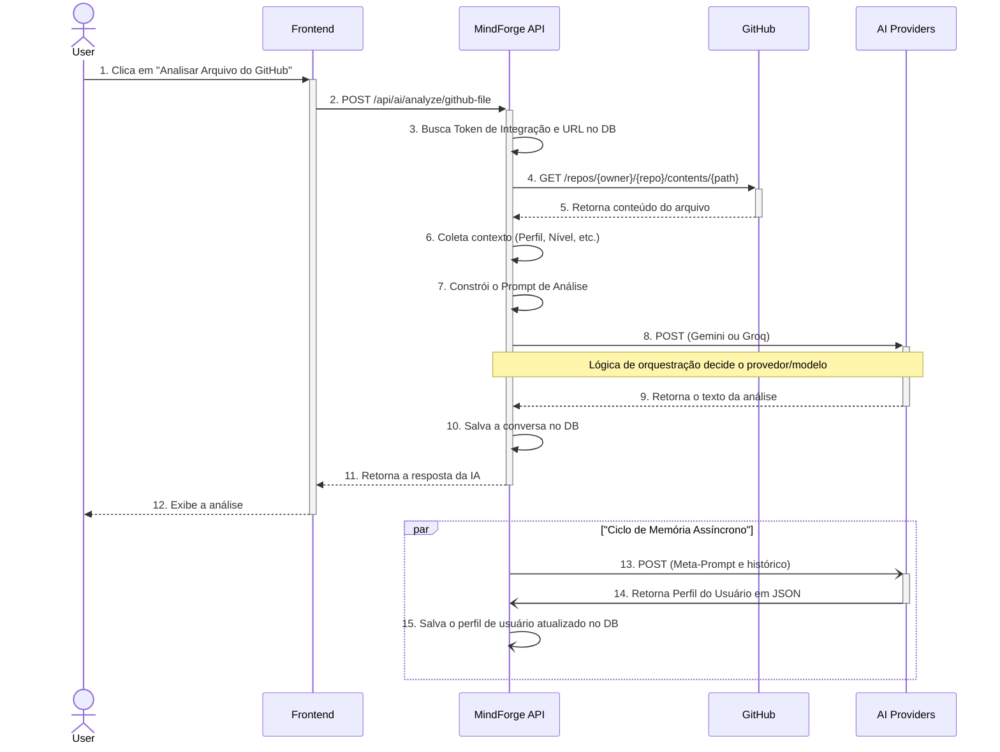
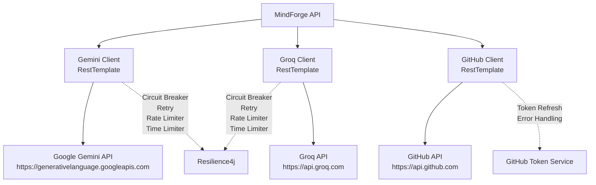
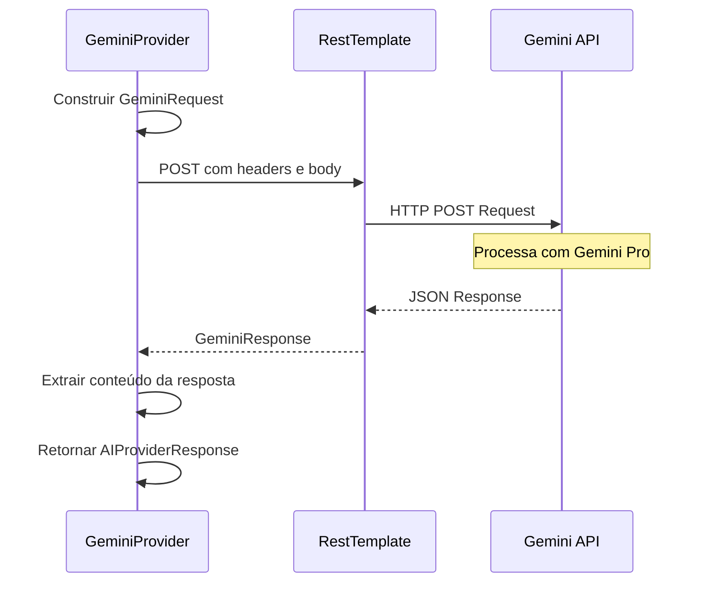
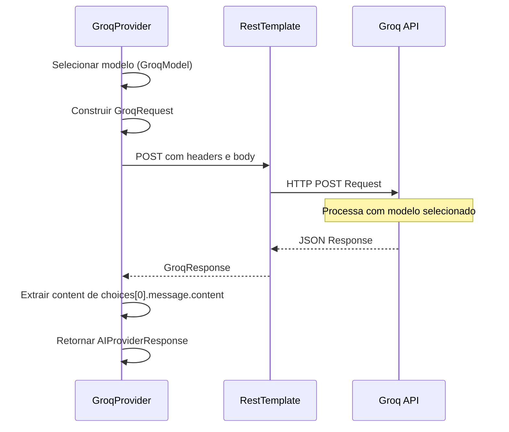
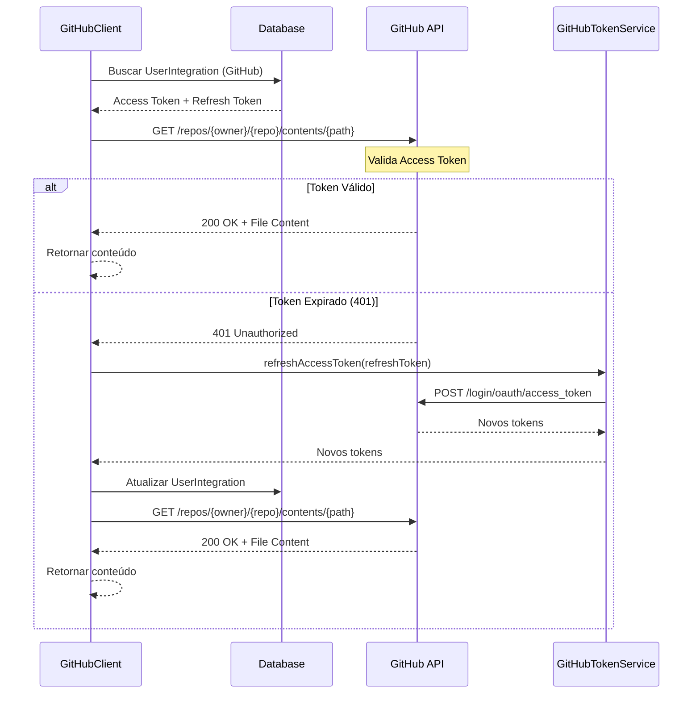
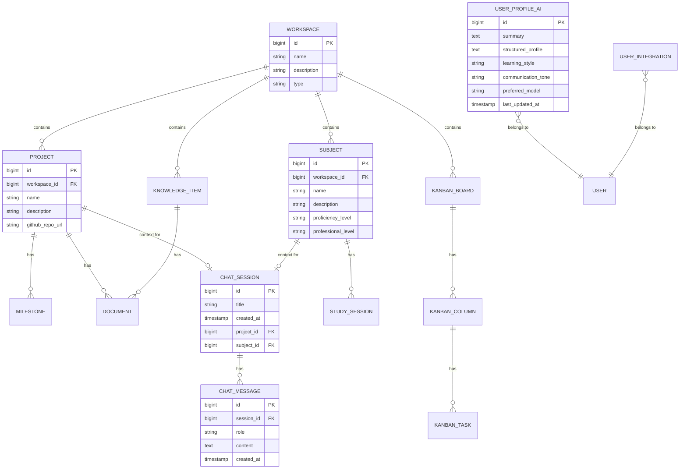

# Arquitetura Técnica Detalhada do MindForge

## Índice

1. [Filosofia e Princípios Arquiteturais](#1-filosofia-e-princípios-arquiteturais)
2. [System Design e Fluxo de Dados](#2-system-design-e-fluxo-de-dados)
3. [Padrão AI Provider e Orquestração](#3-padrão-ai-provider-e-orquestração)
4. [Engenharia de Prompt e Memória](#4-engenharia-de-prompt-e-memória)
5. [Bounded Contexts e Domínios de Negócio](#5-bounded-contexts-e-domínios-de-negócio)
6. [Justificativas Tecnológicas e Trade-offs](#6-justificativas-tecnológicas-e-trade-offs)
7. [Trade-offs Atuais e Roadmap](#7-trade-offs-atuais-e-roadmap)

---

## 1. Filosofia e Princípios Arquiteturais

O MindForge foi concebido para ser mais do que uma API de CRUD tradicional. A visão é criar uma **plataforma de produtividade e aprendizado proativa e inteligente** que atua como um "segundo cérebro". Para alcançar essa visão, a arquitetura foi guiada por princípios fundamentais que equilibram velocidade de desenvolvimento, manutenibilidade e flexibilidade a longo prazo.

### 1.1. Separation of Concerns (SoC)

A lógica de negócio (gerenciamento de dados) é mantida estritamente separada da lógica de integração com IA. Mesmo dentro de um monólito, a camada de IA é desacoplada através de interfaces, garantindo:

- **Modularidade**: Código organizado em módulos claramente definidos
- **Testabilidade**: Facilidade para testar cada camada isoladamente
- **Manutenibilidade**: Mudanças em uma camada não afetam outras
- **Reusabilidade**: Componentes podem ser reutilizados em diferentes contextos

### 1.2. Pragmatismo sobre Dogma

A decisão de integrar IA diretamente na aplicação Java, em vez de usar um microserviço Python, foi uma escolha pragmática para o estágio atual do projeto. Esta decisão:

- **Reduz Complexidade**: Elimina necessidade de infraestrutura adicional
- **Acelera Desenvolvimento**: Reduz overhead de comunicação entre serviços
- **Mantém Flexibilidade**: Design interno (Padrão Strategy/Provider) permite evolução futura

**Trade-off Consciente**: Perda de acesso direto ao ecossistema Python de IA (LangChain, LlamaIndex), mitigada por implementação cuidadosa de padrões em Java.

### 1.3. Manutenibilidade e Evolução

O projeto é estruturado como um **Monólito Modular**:

- **Bounded Contexts**: Domínios de negócio bem definidos (`study`, `project`, etc.)
- **Pacotes Separados**: Cada domínio tem sua própria estrutura e responsabilidades
- **Clareza Estrutural**: Sistema fácil de entender e manter
- **Evolução Incremental**: Base sólida para futura extração para microserviços, se necessário

### 1.4. API-First Design

A API foi projetada para ser consumida por qualquer cliente (web, mobile, desktop):

- **Desacoplamento Frontend**: Frontend é aplicação separada que comunica via REST
- **Contratos Claros**: APIs bem definidas facilitam integração
- **Documentação Automática**: Swagger/OpenAPI para documentação interativa
- **Reutilização**: Mesma API serve múltiplos clientes

---

## 2. System Design e Fluxo de Dados

A arquitetura do MindForge é a de um **Monólito Modular** que orquestra chamadas para APIs externas. O diagrama abaixo ilustra o fluxo completo de dados do sistema: a análise de um arquivo do GitHub com o ciclo de memória.



### 2.1. Componentes Principais do Fluxo

1. **Recepção de Requisição**: Frontend envia requisição HTTP para API
2. **Coleta de Contexto**: Sistema busca dados relevantes (integração GitHub, perfil do usuário)
3. **Construção de Prompt**: Engenharia de prompt com contexto coletado
4. **Orquestração de IA**: Seleção dinâmica de provedor/modelo
5. **Processamento de Resposta**: Validação e formatação da resposta
6. **Persistência**: Salvamento de conversa e contexto
7. **Ciclo de Memória**: Atualização assíncrona do perfil de aprendizado

---

## 3. Padrão AI Provider e Orquestração

Para evitar acoplamento forte com um único modelo de IA, foi implementado o **Padrão Strategy**. O `AIService` depende de uma interface `AIProvider`, e `GeminiProvider` e `GroqProvider` são implementações concretas.

### 3.1. Interface AIProvider

```java
public interface AIProvider {
    String executeTask(String prompt, Map<String, Object> context);
    boolean supportsTaskType(TaskType taskType);
    ProviderCapabilities getCapabilities();
}
```

### 3.2. Serviço de Orquestração

O `GroqOrchestratorService` adiciona uma camada de decisão que permite ao sistema:

- **Seleção Inteligente**: Escolher o provedor/modelo mais adequado para a tarefa
- **Otimização de Recursos**: Usar modelo rápido para tarefas simples, modelo poderoso para análises complexas
- **Fallback Automático**: Implementar lógica de fallback quando modelo primário falha
- **Monitoramento**: Rastrear performance e disponibilidade de cada provedor

### 3.3. Benefícios da Abstração

- **Flexibilidade**: Troca de provedores sem impacto na lógica de negócio
- **Testabilidade**: Facilidade para mockar provedores em testes
- **Extensibilidade**: Adição de novos provedores com implementação mínima
- **Resiliência**: Isolamento de falhas de provedores específicos

---

## 4. Engenharia de Prompt e Memória

A "inteligência" do MindForge não vem exclusivamente do modelo de IA, mas da **orquestração e engenharia de prompt** realizadas pelo `AIService` em Java. O sistema atua como um "diretor de cena", usando técnicas avançadas para controlar o comportamento da IA.

### 4.1. Técnicas de Engenharia de Prompt

#### Atribuição de Persona
Instruções para a IA assumir papéis específicos:
- **"Aja como um Tech Recruiter experiente..."**
- **"Atue como um Mentor de Código didático..."**
- **"Responda como um Product Manager estratégico..."**

#### Injeção de Contexto
Enriquecimento do prompt com dados do sistema:
- Nível de proficiência do usuário em tópicos relevantes
- Perfil de aprendizado construído ao longo do tempo
- Histórico de interações anteriores
- Metadados contextuais da requisição

#### Instruções de Formato
Comandos explícitos para formato de saída:
- **"Retorne a análise em formato Markdown estruturado..."**
- **"Forneça o resultado em JSON com a seguinte estrutura..."**
- **"Organize o feedback em seções: Pontos Fortes, Melhorias, Sugestões..."**

### 4.2. O Módulo de Memória (MemoryService)

O `MemoryService` é o componente que eleva a IA do MindForge de uma ferramenta de "pergunta e resposta" para um **mentor que aprende e se adapta continuamente**.

#### Objetivo
Criar uma memória persistente sobre o perfil de aprendizado do usuário:
- Pontos fortes identificados
- Áreas de dificuldade detectadas
- Interesses e preferências
- Histórico de progresso

#### Impacto na Experiência do Usuário
- **Personalização Progressiva**: Respostas cada vez mais personalizadas
- **Continuidade Contextual**: Sensação de conversa contínua com mentor
- **Evolução Adaptativa**: Sistema se adapta ao perfil do usuário

#### Componentes

**UserProfileAI (Entidade)**
- Armazena "dossiê" da IA sobre o usuário
- Resumo textual do perfil
- JSON estruturado com dados detalhados
- Metadados (timestamps, versão, estatísticas)

**MemoryService (Serviço)**
- Orquestra o ciclo de memória
- Método `updateUserProfile` é **assíncrono (`@Async`)**
- Não impacta latência da resposta principal
- Executa em background thread separada

#### Fluxo do Ciclo de Memória (Meta-Análise)

1. **Trigger Assíncrono**: Após interação, `MemoryService` é chamado em background
2. **Coleta de Contexto**: Busca perfil atual e histórico de conversas
3. **Construção de Meta-Prompt**: Cria instrução para IA analisar a interação
4. **Execução de Meta-Análise**: Chama `AIProvider` com meta-prompt
5. **Processamento de Resposta**: Extrai perfil atualizado da resposta JSON
6. **Persistência**: Salva novo perfil na entidade `UserProfileAI`
7. **Enriquecimento Futuro**: Novo perfil enriquece contexto de próxima interação

#### Trade-offs
- **Chamada Extra**: Gera chamada adicional à API de IA (mitigada pelo `@Async`)
- **Dependência de Qualidade**: Eficácia depende da qualidade do meta-prompt
- **Consistência Eventual**: Aprendizado disponível apenas na próxima requisição
- **Custo**: Incremento no número de chamadas à API externa

---

## 5. Bounded Contexts e Domínios de Negócio

A API é organizada em **Bounded Contexts**, um conceito do Domain-Driven Design (DDD), onde cada domínio tem suas próprias responsabilidades, modelos e vocabulário.

### 5.1. Estrutura de Contextos

```
com.matheusdev.mindforge/
├── study/          # Contexto: Gestão de Estudos
├── project/        # Contexto: Gestão de Projetos
├── kanban/         # Contexto: Fluxo de Trabalho Kanban
├── knowledgeltem/  # Contexto: Base de Conhecimento
├── workspace/      # Contexto: Workspaces
├── document/       # Contexto: Gestão de Documentos
├── ai/             # Contexto: Orquestração de IA
├── integration/    # Integrações Externas
└── exception/      # Tratamento Global de Exceções
```

### 5.2. Study Context

**Responsabilidade**: Gerencia o progresso de aprendizado do usuário.

**Entidades Principais**:
- **`Subject`**: Assuntos de estudo (ex: Java, Spring Boot, DDD)
- **`StudySession`**: Sessões de estudo individual
- **`ProficiencyLevel`**: Níveis de proficiência por tópico

**Serviços**:
- `SubjectService`: Gerenciamento de assuntos
- `StudySessionService`: Rastreamento de sessões

### 5.3. Project Context

**Responsabilidade**: Gerencia o ciclo de vida de projetos.

**Entidades Principais**:
- **`Project`**: Projetos do usuário
- **`Milestone`**: Marcos e objetivos do projeto

**Serviços**:
- `ProjectService`: Gerenciamento de projetos
- `MilestoneService`: Gerenciamento de marcos

### 5.4. Kanban Context

**Responsabilidade**: Gerencia o fluxo de trabalho visual.

**Entidades Principais**:
- **`KanbanBoard`**: Quadros Kanban
- **`KanbanColumn`**: Colunas do quadro
- **`KanbanTask`**: Tarefas do quadro

**Serviços**:
- `KanbanService`: Gerenciamento de quadros e tarefas

### 5.5. Knowledge Context

**Responsabilidade**: Serve como "segundo cérebro" para anotações.

**Entidades Principais**:
- **`KnowledgeItem`**: Itens de conhecimento e anotações

**Serviços**:
- `KnowledgeItemService`: Gerenciamento de itens de conhecimento

### 5.6. Document Context

**Responsabilidade**: Abstrai o armazenamento de arquivos.

**Entidades Principais**:
- **`Document`**: Documentos e arquivos

**Serviços**:
- `DocumentService`: Upload, download e gerenciamento de documentos

### 5.7. AI & Integration Context

**Responsabilidade**: Orquestra toda a inteligência e comunicação externa.

**Entidades Principais**:
- **`ChatSession`**: Sessões de conversa com IA
- **`UserProfileAI`**: Perfil de aprendizado construído pela IA
- **`UserIntegration`**: Integrações externas (GitHub, etc.)

**Serviços**:
- `AIService`: Orquestração principal de IA
- `MemoryService`: Gestão de memória e perfil
- `AIContextService`: Coleta de contexto
- `PromptBuilderService`: Construção de prompts
- `GitHubIntegrationService`: Integração com GitHub

---

## 6. Justificativas Tecnológicas e Trade-offs

### 6.1. Escolha da Stack Java/Spring Boot

**Tecnologias**:
- **Java 21**: Recursos modernos (Records, Pattern Matching, Virtual Threads)
- **Spring Boot 3.3.5**: Framework enterprise maduro e produtivo
- **Spring Framework 6.1**: Ecossistema robusto e extensivo

**Justificativa**:
- **Robustez**: Ecossistema maduro e amplamente testado
- **Produtividade**: Ferramentas e convenções que aceleram desenvolvimento
- **Comunidade**: Grande comunidade e ecossistema de bibliotecas
- **Performance**: Runtime otimizado com JIT compiler

**Trade-offs**:
- **Complexidade Inicial**: Curva de aprendizado mais íngreme
- **Overhead**: Maior consumo de memória comparado a frameworks mais leves
- **Velocidade de Startup**: Mais lento que alternativas minimalistas

### 6.2. Escolha do Padrão AI Provider (Monólito)

**Decisão**: Integrar IA diretamente na aplicação Java.

**Justificativa**:
- **Simplicidade Operacional**: Reduz complexidade de infraestrutura
- **Latência**: Comunicação in-process elimina overhead de rede
- **Coesão de Dados**: Acesso direto a serviços de domínio e banco de dados

**Trade-offs**:
- **Escalabilidade**: Limitada pela capacidade de uma única instância
- **Ecossistema Python**: Perda de acesso a bibliotecas especializadas (LangChain, LlamaIndex)
- **Processamento de IA**: Processamento CPU-intensivo pode competir com lógica de negócio

### 6.3. Escolha dos Modelos de IA (Multi-Provider)

**Provedores**:
- **Google Gemini**: Modelos de linguagem multimodal
- **Groq**: Infraestrutura de IA de alta performance

**Justificativa**:

**Google Gemini**:
- Capacidades multimodais (essencial para OCR e análise de imagens)
- Acessibilidade e facilidade de integração
- Performance de ponta em raciocínio complexo

**Groq**:
- Foco em alta velocidade (tokens/segundo)
- Modelos open-source de baixa latência
- Ideal para interações que exigem resposta rápida

**Arquitetura de Provedores**:
- Permite uso otimizado de cada provedor
- Otimização de custo, velocidade e capacidade
- Adaptação a diferentes tipos de tarefas

**Trade-offs**:
- **Complexidade**: Aumento na lógica de orquestração
- **Gerenciamento**: Necessidade de gerenciar múltiplas chaves de API
- **Contratos**: Diferentes provedores têm contratos distintos

### 6.4. Frontend Desacoplado (API-First)

**Decisão**: API projetada para ser consumida por qualquer cliente.

**Justificativa**:
- **Flexibilidade Tecnológica**: Frontend pode usar qualquer stack (React, Vue, Angular, Mobile)
- **Reutilização**: Mesma API serve múltiplos clientes
- **Evolução Independente**: Frontend e backend podem evoluir separadamente

**Trade-offs**:
- **Desenvolvimento Separado**: Requer construção de aplicação frontend separada
- **Overhead de Comunicação**: Necessidade de serialização/deserialização HTTP
- **CORS e Segurança**: Requer configuração adequada para acesso cross-origin

### 6.5. Persistência: PostgreSQL + JPA/Hibernate

**Justificativa**:
- **SQL Relacional**: Banco de dados relacional maduro e confiável
- **ORM Produtivo**: JPA/Hibernate reduz boilerplate
- **Migrações**: Hibernate auto-DDL facilita desenvolvimento

**Trade-offs**:
- **Flexibilidade**: Menos flexível que NoSQL para casos não-relacionais
- **Performance**: Overhead do ORM em comparação com SQL direto
- **Complexidade**: Curva de aprendizado para otimização de queries

---

## 7. Conexões com APIs Externas e Integrações

O MindForge integra-se com múltiplas APIs externas para fornecer funcionalidades avançadas. Cada integração implementa padrões de resiliência e tratamento de erros adequados.

### 7.1. Arquitetura de Integrações



### 7.2. Integração com Google Gemini API

**Propósito**: Capacidades multimodais, análise de imagens, OCR.

**Cliente HTTP**: `RestTemplate` (Spring Framework)

**Endpoint**: `https://generativelanguage.googleapis.com/v1beta/models/gemini-pro:generateContent`

**Autenticação**: API Key via query parameter (`&key={apiKey}`)

**Características**:
- **Suporte Multimodal**: Texto e imagens (base64)
- **Headers**: `Content-Type: application/json`
- **Request Body**: `GeminiRequest` com lista de `Content` e `Part`
- **Response Body**: `GeminiResponse` com lista de `Candidate`

**Fluxo de Requisição**:


**Resiliência**:
- Circuit Breaker (50% failure rate)
- Retry (3 tentativas, 500ms entre tentativas)
- Rate Limiter (10 chamadas/segundo)
- Time Limiter (5 segundos timeout)
- Fallback method implementado

### 7.3. Integração com Groq API

**Propósito**: Múltiplos modelos/agentes especializados, baixa latência.

**Cliente HTTP**: `RestTemplate` (Spring Framework)

**Endpoint**: Configurável via `groq.api.url` (padrão: `https://api.groq.com/openai/v1/chat/completions`)

**Autenticação**: Bearer Token via header (`Authorization: Bearer {apiKey}`)

**Características**:
- **6 Modelos Disponíveis**: VERSATILE, INSTANT, GPT_OSS, QWEN, SCOUT, MAVERICK
- **Headers**: `Content-Type: application/json`, `Authorization: Bearer {apiKey}`
- **Request Body**: `GroqRequest` com `model`, `messages`, `max_tokens`, `reasoning_effort`
- **Response Body**: `GroqResponse` com lista de `Choice` e `Message`

**Fluxo de Requisição**:


**Orquestração com Fallback**:
O `GroqOrchestratorService` implementa fallback automático entre modelos:
1. Tenta com modelo preferencial (ex: VERSATILE)
2. Se falhar, tenta automaticamente com modelo de fallback (ex: INSTANT)
3. Logging detalhado para monitoramento

**Resiliência**:
- Circuit Breaker (50% failure rate)
- Retry (3 tentativas, 500ms entre tentativas)
- Rate Limiter (10 chamadas/segundo)
- Time Limiter (5 segundos timeout)
- Fallback method implementado

### 7.4. Integração com GitHub API

**Propósito**: Buscar conteúdo de arquivos de repositórios para análise de código.

**Cliente HTTP**: `RestTemplate` (Spring Framework)

**Endpoint**: `https://api.github.com/repos/{owner}/{repo}/contents/{path}`

**Autenticação**: Bearer Token via header (`Authorization: Bearer {accessToken}`)

**Características**:
- **OAuth 2.0**: Integração via tokens de acesso e refresh
- **Token Refresh**: Atualização automática de tokens expirados
- **Headers**: `Authorization: Bearer {token}`, `Accept: application/vnd.github.v3.raw`
- **Response**: Conteúdo do arquivo como texto plano

**Fluxo de Requisição com Refresh Token**:


**Tratamento de Erros**:
- **401 Unauthorized**: Tenta refresh token automaticamente
- **404 Not Found**: Repositório ou arquivo não encontrado
- **403 Forbidden**: Sem permissão de acesso
- **Rate Limiting**: GitHub pode limitar requisições (não implementado ainda)

**Segurança**:
- Tokens armazenados de forma segura no banco de dados
- Refresh automático de tokens expirados
- Tratamento de erros de autenticação robusto

### 7.5. Configuração de RestTemplate

O projeto utiliza `RestTemplate` para todas as chamadas HTTP externas:

**Configuração Atual**:
- Injeção via construtor em cada provider/client
- Sem configuração global (padrão Spring Boot)

**Características**:
- **Serialização**: JSON automático via Jackson
- **Error Handling**: Exceções HTTP tratadas localmente
- **Timeouts**: Não configurados (usa padrão JVM)

**Recomendações Futuras**:
- Configurar timeouts globais
- Implementar interceptors para logging
- Considerar migração para WebClient (reativo)

---

## 8. Modelagem de Dados e Esquema do Banco

O MindForge utiliza **PostgreSQL** como banco de dados relacional, com mapeamento objeto-relacional via **JPA/Hibernate**.

### 8.1. Diagrama de Entidade-Relacionamento (ER)



### 8.2. Entidades Principais e Relacionamentos

#### Workspace (Raiz de Agregação)
- **Relacionamentos**:
  - `OneToMany` com `Project`
  - `OneToMany` com `Subject`
  - `OneToMany` com `KanbanBoard`
  - `OneToMany` com `KnowledgeItem`

#### Project
- **Relacionamentos**:
  - `ManyToOne` com `Workspace`
  - `OneToMany` com `Milestone`
  - `OneToMany` com `Document`
  - `OneToMany` com `ChatSession` (contexto)

#### Subject
- **Relacionamentos**:
  - `ManyToOne` com `Workspace`
  - `OneToMany` com `StudySession`
  - `OneToMany` com `ChatSession` (contexto)

#### ChatSession
- **Relacionamentos**:
  - `OneToMany` com `ChatMessage`
  - `ManyToOne` com `Project` (opcional - contexto)
  - `ManyToOne` com `Subject` (opcional - contexto)

#### UserProfileAI
- **Armazena**: Perfil de aprendizado do usuário construído pela IA
- **Campos Especiais**:
  - `summary`: Texto em linguagem natural
  - `structuredProfile`: JSON com dados estruturados
  - `learningStyle`: Enum (PRACTICAL, THEORETICAL, etc.)
  - `communicationTone`: Enum (ENCOURAGING, DIRECT, etc.)
  - `preferredModel`: Modelo de IA preferido do usuário

### 8.3. Estratégias de Persistência

**Fetch Types**:
- **LAZY**: Relacionamentos `@ManyToOne` e `@OneToMany` por padrão
- **EAGER**: Não utilizado (evita N+1 queries)

**Cascading**:
- **CascadeType.ALL**: Relacionamentos pai-filho (ex: `Project` → `Milestone`)
- **orphanRemoval**: Habilitado para relacionamentos de dependência

**Timestamps**:
- **@PrePersist**: Define `createdAt` automaticamente
- **@PreUpdate**: Atualiza `lastUpdatedAt` automaticamente

**Geração de IDs**:
- **@GeneratedValue(strategy = GenerationType.IDENTITY)**: IDs auto-incrementais

### 8.4. Tratamento de Dados

#### Validação de Entrada
- **Bean Validation**: Anotações `@NotNull`, `@NotEmpty`, `@Size` nas entidades
- **Camada de Serviço**: Validação de regras de negócio
- **Tratamento Global**: `RestExceptionHandler` centraliza tratamento de erros

#### Transformação de Dados
- **MapStruct**: Mapeamento type-safe entre Entidades e DTOs
- **DTOs**: Separação entre modelo de domínio e representação da API
- **Serialização**: Jackson para JSON automático

#### Cache
- **Caffeine Cache**: Cache em memória para consultas frequentes
- **Configuração**: TTL e tamanho configuráveis
- **Invalidação**: Cache invalidado em operações de escrita

---

## 9. Trade-offs Atuais e Roadmap

### 9.1. Autenticação e Perfil de Usuário (Trade-offs Atuais)

**Estado Atual**:
O projeto opera como **single-user** com um `userId` fixo (`1L`). A complexidade de segurança e multi-tenancy foi conscientemente adiada para focar na lógica de IA e arquitetura core.

**Implicações**:
- **Segurança**: API aberta, sem autenticação
- **Multi-tenancy**: Personalização limitada a um único perfil
- **Escalabilidade**: Preparado para suportar múltiplos usuários quando necessário

**Justificativa**:
- **Foco**: Priorização de funcionalidades core de IA
- **Desenvolvimento Acelerado**: Redução de complexidade inicial
- **Arquitetura Preparada**: Estrutura permite adição futura de autenticação

### 7.2. Próximas Atualizações (Roadmap)

#### Curto Prazo
1. **Sistema de Autenticação e Autorização**
   - Spring Security + JWT
   - Proteção de endpoints
   - Gerenciamento de sessões

2. **Suporte Multi-Usuário**
   - Criação de perfil de usuário
   - Isolamento de dados por usuário
   - Workspaces individuais

#### Médio Prazo
3. **Workspaces Colaborativos**
   - Compartilhamento de projetos e estudos
   - Gerenciamento de permissões
   - Colaboração em tempo real

4. **Refinamento da Memória da IA**
   - Aprimoramento dos meta-prompts
   - Perfil de aprendizado mais detalhado
   - Personalização avançada

#### Longo Prazo
5. **Métricas e Observabilidade**
   - Micrometer + Prometheus
   - Grafana dashboards
   - Alertas e monitoramento

6. **Otimização de Performance**
   - Testes de carga
   - Cache estratégico
   - Otimização de queries

7. **CI/CD Completo**
   - Pipeline automatizado
   - Deploy automatizado
   - Testes automatizados

---

## 8. Conclusão

Este documento serve como um guia abrangente para a arquitetura do MindForge, detalhando suas escolhas de design, fluxos de dados, padrões implementados e o caminho para sua evolução.

A arquitetura do MindForge demonstra como princípios sólidos de engenharia de software podem ser aplicados para construir sistemas inteligentes, robustos e manuteníveis que agregam valor real aos usuários.

---

## Referências

- [Spring Boot Documentation](https://spring.io/projects/spring-boot)
- [Domain-Driven Design](https://martinfowler.com/bliki/DomainDrivenDesign.html)
- [Pattern: Monolithic Architecture](https://martinfowler.com/articles/microservices.html)
- [Resilience4j Documentation](https://resilience4j.readme.io/)
