# Arquitetura Detalhada do Módulo de Inteligência Artificial

## Índice

1. [Visão Geral e Filosofia](#1-visão-geral-e-filosofia)
2. [Decisões Arquiteturais Fundamentais](#2-decisões-arquiteturais-fundamentais)
3. [Arquitetura Dinâmica: Fluxo de Requisições](#3-arquitetura-dinâmica-fluxo-de-requisições)
4. [Ciclo de Memória Assíncrono](#4-ciclo-de-memória-assíncrono)
5. [Resiliência e Tratamento de Falhas](#5-resiliência-e-tratamento-de-falhas)
6. [Padrões de Engenharia de Prompt](#6-padrões-de-engenharia-de-prompt)
7. [Orquestração Multi-Provider](#7-orquestração-multi-provider)
8. [Agente de Conhecimento (Writer/Editor)](#8-agente-de-conhecimento-writereditor)
9. [Conclusão](#9-conclusão)

---

## 1. Visão Geral e Filosofia

A arquitetura de IA do MindForge é fundamentada no princípio de **orquestração inteligente** em vez de dependência exclusiva de um único modelo de linguagem. Esta abordagem permite:

- **Flexibilidade**: Adaptação a diferentes tipos de tarefas e contextos
- **Resiliência**: Continuidade de serviço mesmo em caso de falha de um provedor
- **Otimização**: Uso otimizado de recursos (latência, custo, capacidade)
- **Evolução**: Facilidade para integrar novos modelos e provedores

A arquitetura foi projetada para transformar modelos de linguagem genéricos em **mentores especializados e contextualmente conscientes**, utilizando técnicas avançadas de engenharia de prompt e orquestração.

---

## 2. Decisões Arquiteturais Fundamentais

### 2.1. Orquestração em Java vs. Microserviço em Python

**Decisão**: Manter a lógica de IA dentro do monólito modular Java/Spring Boot.

**Justificativa**:
- **Coesão de Dados**: Acesso direto a serviços de domínio e banco de dados para coleta de contexto rico
- **Baixa Latência**: Comunicação in-process elimina overhead de rede
- **Simplicidade Operacional**: Redução de complexidade de infraestrutura e deployment
- **Consistência Transacional**: Capacidade de participar em transações distribuídas quando necessário

**Trade-offs**:
- **Ecossistema Python**: Acesso limitado a bibliotecas especializadas (LangChain, LlamaIndex)
- **Mitigação**: Implementação de padrões de design sólidos em Java que replicam funcionalidades essenciais

### 2.2. Padrões Strategy & Factory para Provedores de IA

**Decisão**: Abstrair a comunicação com APIs via `AIProvider` (Strategy) e gerenciar a criação via Spring `Map<String, AIProvider>` (Factory implícito).

**Justificativa**:
O padrão **Strategy** torna o sistema agnóstico ao provedor, enquanto o **Factory** permite a seleção dinâmica baseada em string (configuração ou decisão em tempo de execução).

1. **Flexibilidade Extensível**
   - Troca de provedores sem impacto na lógica de negócio
   - Adição de novos provedores (Anthropic, OpenAI) com implementação mínima
   - Isolamento de detalhes de implementação de cada provedor (Ollama, Groq)

2. **Otimização Contextual**
   - Seleção dinâmica de provedor baseada no tipo de tarefa
   **Local First (Privacy & Cost)**
       - Uso de Ollama (Llama 3, Qwen) como padrão para zero-cost inference
       - Processamento de dados sensíveis inteiramente local (privacidade total)
   
   **Cloud Bursting (Performance)**
       - Uso de Groq (Llama 3 70B) para tarefas complexas que exigem raciocínio avançado
       - Fallback automático para Groq quando Ollama está indisponível ou sobrecarregado

**Trade-offs**:
- **Complexidade Inicial**: Camada adicional de abstração requer design cuidadoso
- **Manutenção**: Necessidade de manter contratos de interface consistentes

### 2.3. Ciclo de Memória Assíncrono

**Decisão**: Executar a atualização de memória da IA em thread separada (`@Async`).

**Justificativa**:
- **Latência Otimizada**: Resposta ao usuário não é penalizada pela "inteligência" do sistema
- **Experiência do Usuário**: Feedback imediato enquanto o aprendizado ocorre em background
- **Escalabilidade**: Processamento assíncrono permite maior throughput

**Trade-offs**:
- **Consistência Eventual**: Aprendizado de uma interação disponível apenas na próxima requisição
- **Aceitação**: Para o caso de uso de mentor, consistência eventual é perfeitamente aceitável

---

## 3. Arquitetura Dinâmica: Fluxo de Requisições

O diagrama abaixo ilustra o fluxo completo de uma requisição de análise de código, demonstrando a colaboração entre todos os componentes do sistema.

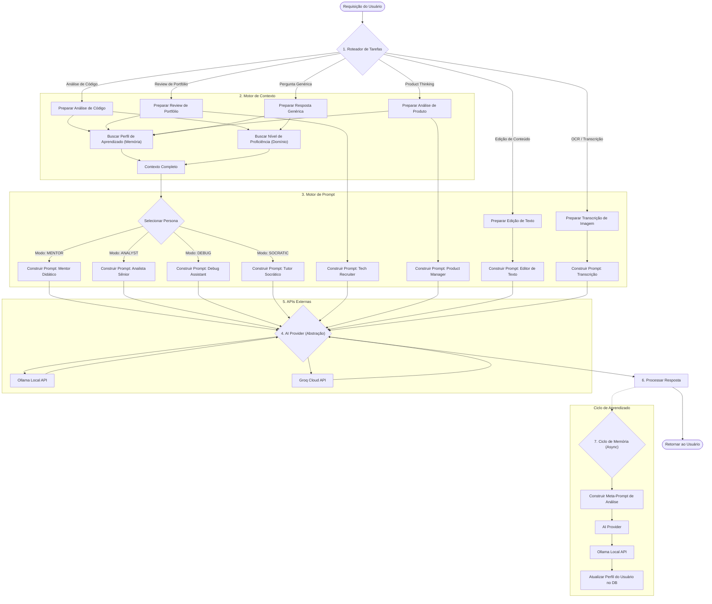

### 3.1. Fase 1: Roteamento de Tarefas (Facade Pattern)

O `AIOrchestrationService` atua como **Facade**, simplificando a complexidade dos múltiplos orquestradores especializados. Ele recebe a requisição e a encaminha para o especialista correto:

- **ChatOrchestrator**: Fluxo conversacional completo (agente + comando)
- **DocumentAnalysisOrchestrator**: Processamento de arquivos e RAG
- **QuizGeneratorService**: Geração de avaliações educacionais
- **RoadmapGeneratorService**: Planejamento de estudos
- **InternalAnalysisService**: Tarefas de background e análise técnica

### 3.2. Fase 2: Motor de Contexto

O `AIContextService` coleta e estrutura o contexto necessário para a requisição:

- **Perfil de Aprendizado**: Dados do `MemoryService` sobre o histórico do usuário
- **Nível de Proficiência**: Informações do domínio de estudos sobre o conhecimento do usuário
- **Histórico de Conversas**: Contexto de interações anteriores
- **Metadados**: Informações adicionais relevantes ao tipo de tarefa

### 3.3. Fase 3: Motor de Prompt (Chain of Responsibility)

O pipeline de construção de prompts utiliza o padrão **Chain of Responsibility** onde cada `PromptBuildingStep` enriquece o contexto sequencialmente:

1. **ValidationStep**: Valida inputs e regras de negócio
2. **ContextRetrievalStep**: Busca dados do usuário e domínio
3. **PromptBuildingStep**: Constrói o texto final usando templates e personas
4. **ExecutionStep**: Seleciona o provider (via Factory) e executa a chamada
5. **AuditStep**: Persiste logs e memória assíncrona

### 3.4. Fase 4: Abstração de Provedor

O `AIProvider` atua como camada de abstração que:

- Oculta detalhes de implementação de cada provedor
- Permite seleção dinâmica de provedor/modelo
- Implementa padrões de resiliência (Circuit Breaker, Retry, etc.)
- Normaliza respostas de diferentes provedores

### 3.5. Fase 5: APIs Externas

Integração com provedores externos:

- **Ollama**: Para privacidade e execução local (padrão)
- **Groq**: Para tarefas que exigem baixa latência e alta throughput

---

### 3.6. Fluxos Especializados e Web Research

Além do chat padrão, a arquitetura suporta fluxos complexos que integram **pesquisa na web (Tavily)** para garantir factualidade e atualidade.

#### 3.6.1. Integração de Web Research (RAG Dinâmico)

O `WebSearchService` permite que a IA acesse a internet em tempo real. Diferente do RAG tradicional (baseado em arquivos), este é um **Web-RAG**:

1. **Query Generation**: IA analisa a solicitação e gera N queries de busca.
2. **Search Execution**: `TavilyWebSearchEngine` executa buscas paralelas.
3. **Content Extraction**: Extrai conteúdo relevante (não apenas metadados).
4. **Context Injection**: Resultados são injetados no prompt do sistema.
5. **Citational Response**: IA gera resposta citando as fontes encontradas.

#### 3.6.2. Fluxo: Geração de Quiz (Study Domain)

Gera avaliações baseadas em anotações do usuário + conhecimento atualizado da web.

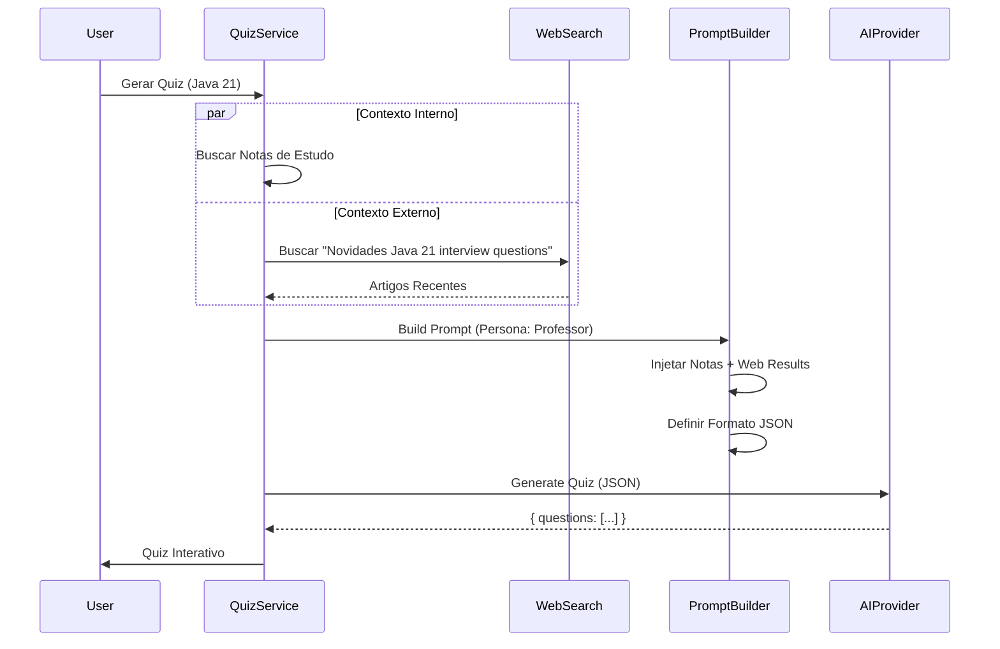

#### 3.6.3. Fluxo: Geração de Roadmap (Product Thinking)

Cria planos de estudo estruturados, validando a existência de cursos e materiais na web.

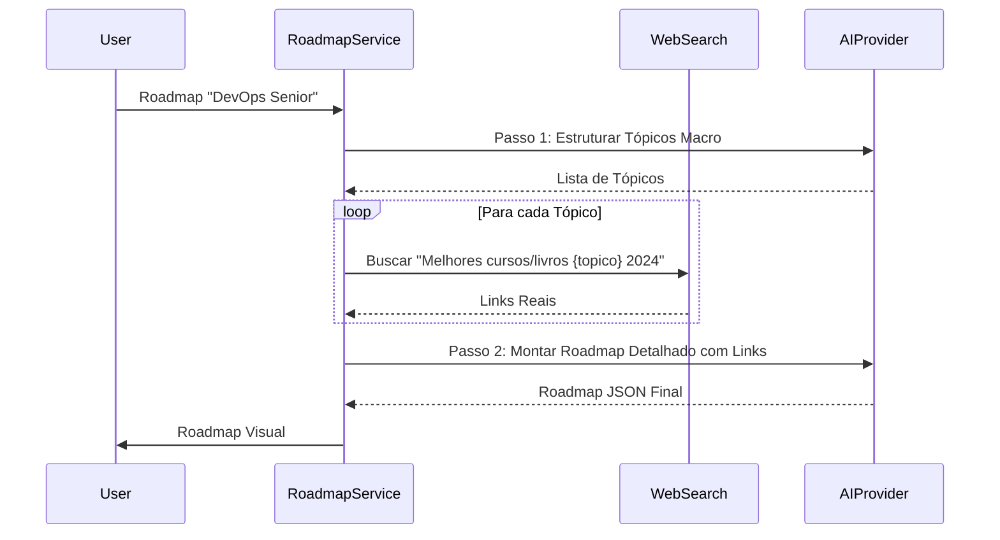

## 4. Ciclo de Memória Assíncrono

O ciclo de memória é o mecanismo que permite à IA evoluir de uma ferramenta de pergunta-resposta para um **mentor que aprende continuamente**. O diagrama abaixo foca exclusivamente neste processo.

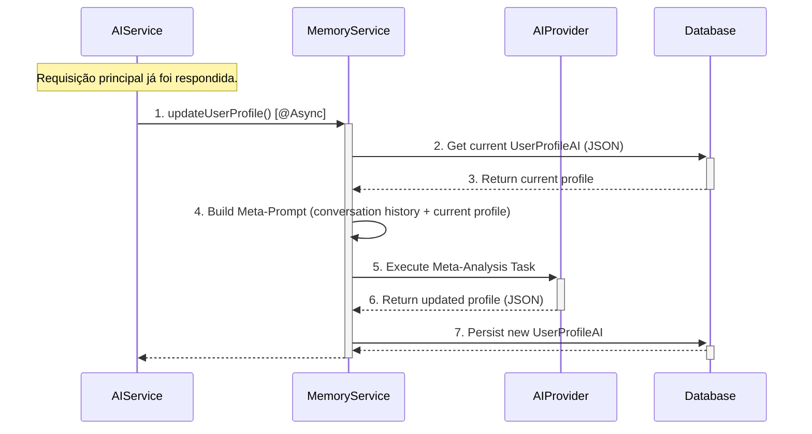

### 4.1. O Conceito de Meta-Prompt

O **Meta-Prompt** é uma técnica avançada de engenharia de prompt onde a IA é instruída a analisar sua própria interação e estado anterior para gerar um novo estado atualizado.

**Exemplo de Meta-Prompt**:
```
Analise a conversa a seguir e o perfil JSON existente. 
O usuário demonstrou entendimento sólido de 'SOLID principles' 
mas apresentou dificuldade com 'Java Streams API'. 
Retorne um NOVO perfil JSON atualizado com esses aprendizados, 
incluindo níveis de proficiência ajustados e tópicos sugeridos 
para estudo futuro. Mantenha o formato JSON estritamente.
```

### 4.2. Estrutura do Perfil de Usuário

O `UserProfileAI` armazena:

- **Resumo Textual**: Descrição narrativa do perfil de aprendizado
- **JSON Estruturado**: Dados estruturados sobre pontos fortes, fracos, interesses
- **Histórico de Interações**: Referências a conversas anteriores
- **Metadados**: Timestamps, versão do perfil, estatísticas

### 4.3. Impacto no Sistema

Este mecanismo cria um **ciclo de feedback positivo**:

- A IA se torna progressivamente mais consciente do contexto do usuário
- Respostas futuras são mais personalizadas e relevantes
- O sistema evolui de ferramenta para mentor adaptativo
- A experiência do usuário melhora continuamente

---

## 5. Resiliência e Tratamento de Falhas

Um sistema que depende de serviços de rede externos deve ser inerentemente resiliente. A arquitetura do MindForge incorpora múltiplos padrões de resiliência utilizando a biblioteca **Resilience4j**, com configurações específicas para cada tipo de serviço.

### 5.1. Arquitetura de Resiliência

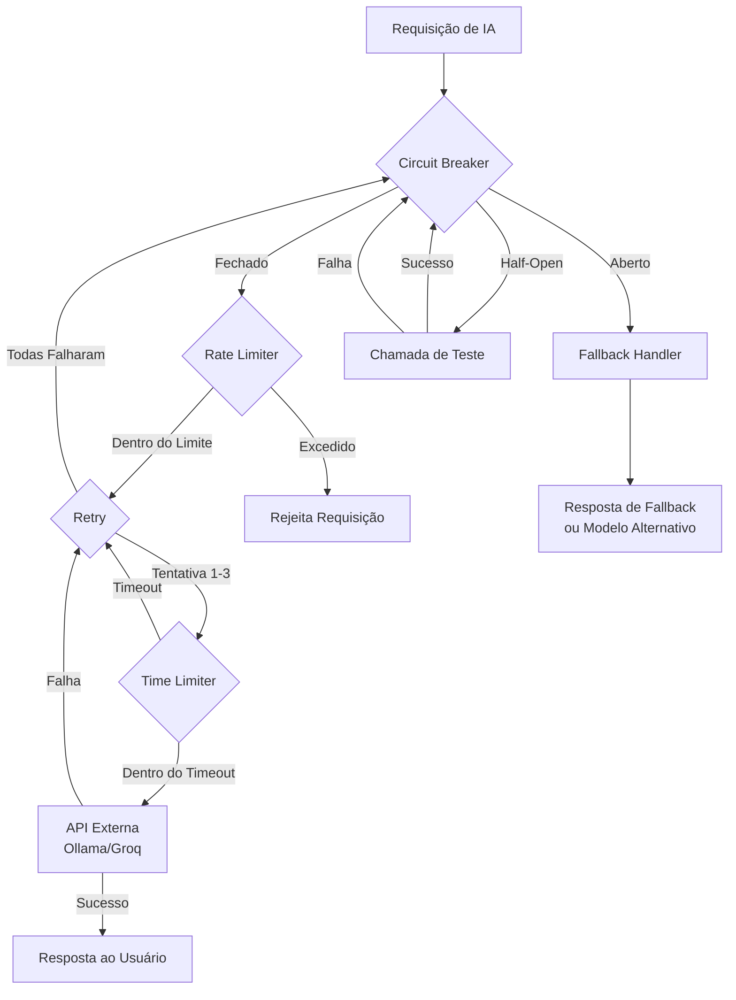

### 5.2. Configurações de Resiliência

O sistema utiliza configurações centralizadas em `ResilienceConfig`:

#### Instâncias de Resiliência

- **`aiProvider`**: Configuração para provedores de IA (Ollama, Groq)
- **`githubClient`**: Configuração para integração GitHub (futuro)

#### Circuit Breaker

**Configuração** (`aiProvider`):
- **Failure Rate Threshold**: 50% (circuito abre quando 50% das chamadas falham)
- **Sliding Window Size**: 10 chamadas (janela deslizante de 10 chamadas)
- **Wait Duration in Open State**: 10 segundos (tempo antes de tentar recuperação)
- **Half-Open State**: Permite 1 chamada de teste após timeout

**Estados do Circuit Breaker**:
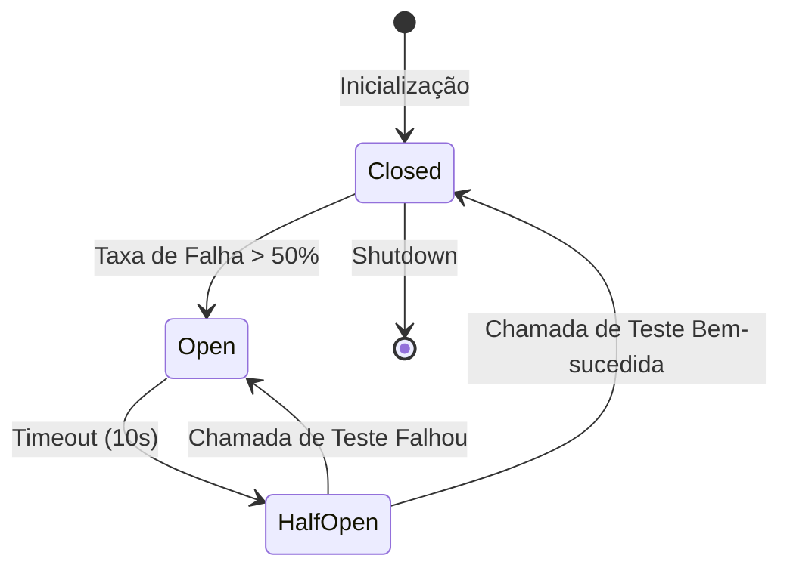

**Implementação**:
```java
@CircuitBreaker(name = ResilienceConfig.AI_PROVIDER_INSTANCE, fallbackMethod = "fallback")
```

**Benefícios**:
- **Proteção contra Cascata**: Previne sobrecarga de sistema externo já falhando
- **Economia de Recursos**: Não tenta chamadas sabidamente falhas
- **Recuperação Automática**: Tenta recuperação após período configurado
- **Fallback Inteligente**: Chama método de fallback quando circuito aberto

#### Retry

**Configuração** (`aiProvider`):
- **Max Attempts**: 3 tentativas totais
- **Wait Duration**: 500ms entre tentativas
- **Retry Strategy**: Exponential Backoff (futuro)

**Implementação**:
```java
@Retry(name = ResilienceConfig.AI_PROVIDER_INSTANCE)
```

**Comportamento**:
- Tentativa 1: Chamada inicial
- Tentativa 2: Após 500ms em caso de falha
- Tentativa 3: Após mais 500ms em caso de falha
- Após 3 tentativas: Falha propagada ou fallback acionado

**Benefícios**:
- **Recuperação Automática**: Trata falhas transitórias de rede
- **Redução de Falhas Percebidas**: Muitas falhas temporárias são resolvidas
- **Transparência**: Tentativas automáticas sem intervenção do usuário

### 5.2. Retry

**Implementação**: Anotação `@Retry` em métodos críticos.

**Configuração**:
- Número máximo de tentativas
- Intervalo exponencial entre tentativas
- Exceções que devem ou não ser retentadas

**Benefícios**:
- Recuperação automática de falhas transitórias
- Redução de falhas percebidas pelo usuário
- Tratamento inteligente de problemas temporários de rede

### 5.3. Rate Limiter

**Implementação**: Anotação `@RateLimiter` em chamadas para APIs externas.

**Configuração** (`aiProvider`):
- **Limit Refresh Period**: 1 segundo (janela de tempo)
- **Limit For Period**: 10 chamadas por segundo
- **Timeout Duration**: 500ms (tempo máximo de espera por slot disponível)

**Implementação**:
```java
@RateLimiter(name = ResilienceConfig.AI_PROVIDER_INSTANCE)
```

**Comportamento**:
- **Dentro do Limite**: Chamada processada imediatamente
- **Limite Excedido**: Aguarda até 500ms por slot disponível
- **Timeout**: Rejeita requisição após 500ms de espera

**Limites por Segundo**:
- **Máximo**: 10 chamadas/segundo para provedores de IA
- **Janela Deslizante**: Renovação contínua a cada segundo
- **Proteção**: Previne exceder limites de APIs externas

**Benefícios**:
- **Conformidade**: Respeita limites de rate das APIs externas
- **Prevenção de Custos**: Evita custos inesperados por excesso de chamadas
- **Proteção contra Bloqueios**: Previne bloqueios de API por rate limiting
- **Fairness**: Distribuição equitativa de recursos entre requisições

**Exemplo de Uso**:
```java
// Configuração permite 10 chamadas/segundo
// Requisições 1-10: Processadas imediatamente
// Requisição 11: Aguarda até 500ms por slot
// Se nenhum slot disponível após 500ms: Rejeita
```

### 5.4. Time Limiter

**Implementação**: Anotação `@TimeLimiter` com timeout configurável.

**Configuração** (`aiProvider`):
- **Timeout Duration**: 5 segundos (tempo máximo de espera por resposta)

**Implementação**:
```java
@TimeLimiter(name = ResilienceConfig.AI_PROVIDER_INSTANCE)
```

**Comportamento**:
- **Dentro do Timeout**: Resposta retornada normalmente
- **Timeout Excedido**: Chamada interrompida e exceção lançada
- **Propagação**: Exceção propaga para camadas superiores ou fallback

**Benefícios**:
- **Prevenção de Threads Bloqueadas**: Threads não ficam aguardando indefinidamente
- **Controle de Latência**: Garante resposta ou falha dentro de tempo definido
- **Liberação de Recursos**: Threads liberadas para outras requisições
- **Experiência do Usuário**: Timeout adequado evita esperas excessivas

**Fluxo de Timeout**:
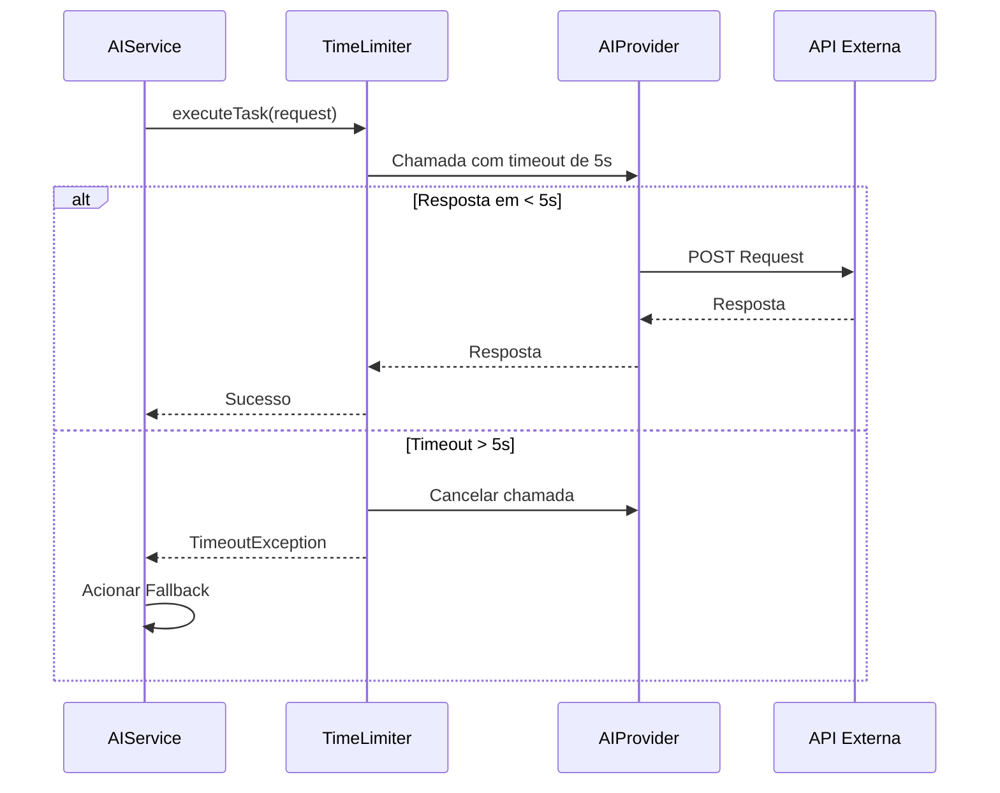

### 5.5. Fallback Strategy

**Implementação**: Lógica de orquestração no `GroqOrchestratorService` e métodos de fallback em cada provider.

**Comportamento**:
- **Nível de Provider**: Cada `AIProvider` implementa método `fallback()` chamado quando Circuit Breaker abre
- **Nível de Orquestração**: `GroqOrchestratorService` implementa fallback entre modelos (VERSATILE → INSTANT)
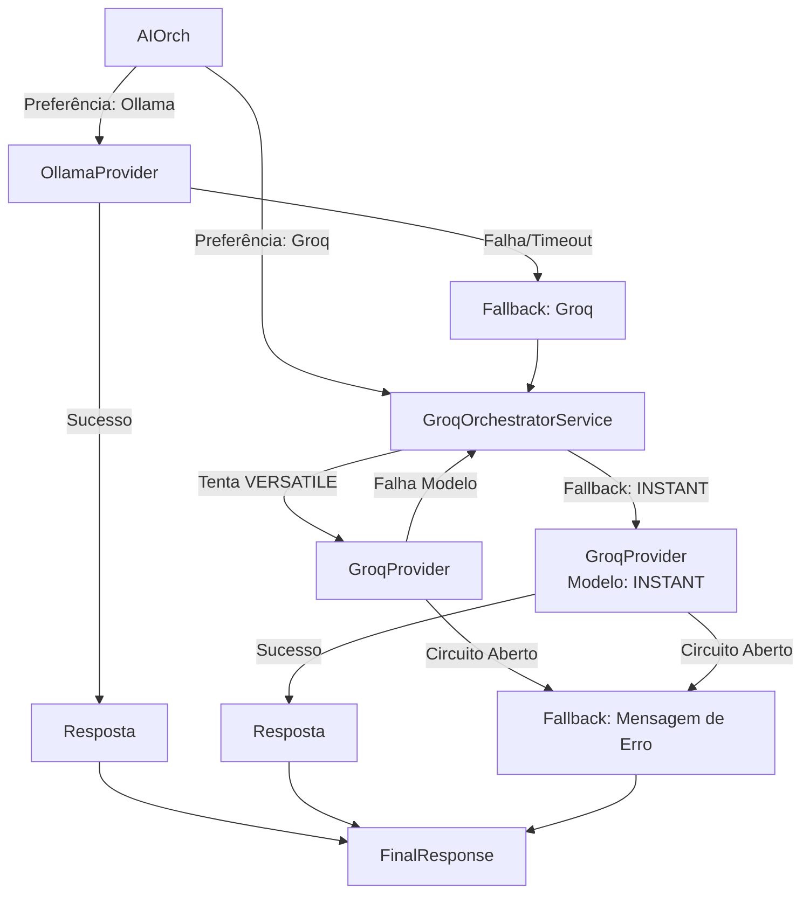

**Benefícios**:
- **Alta Disponibilidade**: Continuidade mesmo com falhas parciais de componentes
- **Degradação Graciosa**: Usa alternativas disponíveis automaticamente
- **Experiência do Usuário**: Resposta sempre fornecida, mesmo que simplificada
- **Resiliência em Múltiplas Camadas**: Proteção em provider, orquestração e global

### 5.6. Resumo das Configurações de Resiliência

**Tabela de Configurações** (`aiProvider`):

| Padrão | Configuração | Valor | Descrição |
|--------|-------------|-------|-----------|
| **Circuit Breaker** | Failure Rate Threshold | 50% | Taxa de falha para abrir circuito |
| | Sliding Window Size | 10 | Janela de chamadas para cálculo |
| | Wait Duration (Open State) | 10s | Tempo antes de tentar recuperação |
| **Retry** | Max Attempts | 3 | Número máximo de tentativas |
| | Wait Duration | 500ms | Intervalo entre tentativas |
| **Rate Limiter** | Limit Refresh Period | 1s | Período de renovação do limite |
| | Limit For Period | 10 | Chamadas máximas por período |
| | Timeout Duration | 500ms | Tempo máximo de espera por slot |
| **Time Limiter** | Timeout Duration | 180s | Tempo máximo de espera por resposta (aumentado para Ollama) |

**Instâncias de Resiliência**:
- `aiProvider`: Provedores de IA (Ollama, Groq)
- `githubClient`: Cliente GitHub (configuração futura)

---

## 6. Padrões de Engenharia de Prompt

A eficácia do sistema depende criticamente da qualidade dos prompts. A arquitetura implementa vários padrões de engenharia de prompt:

### 6.1. Persona Assignment

Atribuição de papéis específicos à IA:
- **Mentor**: Orientação didática e pedagógica
- **Analista**: Análise técnica profunda
- **Tutor Socrático**: Aprendizado guiado por perguntas
- **Tech Recruiter**: Análise profissional de portfólio
- **Product Manager**: Análise estratégica de produto

### 6.2. Context Injection

Enriquecimento de prompts com:
- Perfil de aprendizado do usuário
- Nível de proficiência em tópicos relevantes
- Histórico de interações anteriores
- Metadados contextuais

### 6.3. Format Specification

Instruções claras sobre formato de saída:
- Markdown estruturado para análises
- JSON para dados estruturados
- Formatação específica para diferentes casos de uso

### 6.4. Task Decomposition

Quebra de tarefas complexas em subtarefas:
- Análise estruturada por componentes
- Feedback organizado por categoria
- Sugestões priorizadas e categorizadas

---

## 7. Orquestração Multi-Provider e Múltiplos Agentes Groq

O sistema implementa orquestração inteligente para selecionar o provedor/modelo mais adequado para cada tarefa, com suporte especial para múltiplos modelos através da API Groq.

### 7.1. Critérios de Seleção

- **Tipo de Tarefa**: Análise complexa vs. resposta rápida
- **Requisitos de Modalidade**: Texto, imagem, multimodal
- **Latência Esperada**: Baixa vs. tolerância a latência
- **Capacidade do Modelo**: Tamanho de contexto, capacidade de raciocínio
- **Custo-Benefício**: Balanceamento entre qualidade e custo

### 7.2. Detalhes de Implementação

#### Ollama (Local)
- **Forças**: Gratuito, privado, zero-latência de rede
- **Uso**: Processamento padrão de texto, RAG e meta-análise
- **Modelos**: Llama 3, Mistral, Qwen
- **Configuração**: 
  - URL: `http://localhost:11434/api/chat`
  - Timeout: 180 segundos (permite processamento completo)
  - Fallback: Groq (se Ollama falhar ou timeout)
- **Salvamento no Banco**: Todas as interações são salvas automaticamente para RAG

#### Groq (Cloud)

#### Groq - Múltiplos Agentes/Modelos

O Groq Provider implementa **6 modelos especializados** que funcionam como agentes distintos, cada um otimizado para diferentes tipos de tarefas:

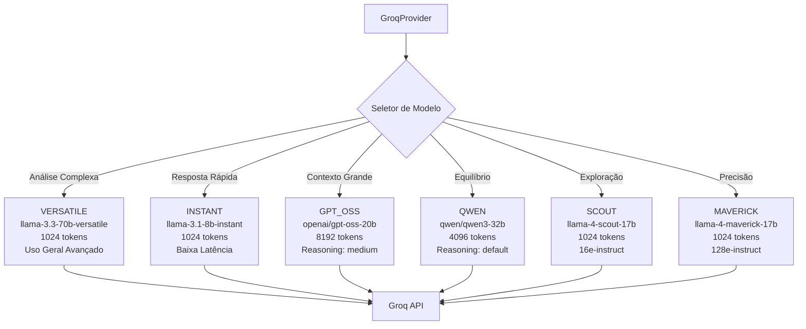

**Especificação dos Modelos Groq:**

1. **VERSATILE** (`llama-3.3-70b-versatile`)
   - **Capacidade**: 70 bilhões de parâmetros
   - **Contexto**: 1024 tokens
   - **Uso**: Análise complexa, raciocínio profundo, tarefas gerais avançadas
   - **Latência**: Média
   - **Reasoning Effort**: N/A (padrão)

2. **INSTANT** (`llama-3.1-8b-instant`)
   - **Capacidade**: 8 bilhões de parâmetros
   - **Contexto**: 1024 tokens
   - **Uso**: Respostas rápidas, tarefas simples, fallback padrão
   - **Latência**: Muito baixa
   - **Reasoning Effort**: N/A (padrão)

3. **GPT_OSS** (`openai/gpt-oss-20b`)
   - **Capacidade**: 20 bilhões de parâmetros
   - **Contexto**: 8192 tokens (maior contexto disponível)
   - **Uso**: Tarefas que exigem contexto extenso, análise de documentos longos
   - **Latência**: Média-Alta
   - **Reasoning Effort**: Medium

4. **QWEN** (`qwen/qwen3-32b`)
   - **Capacidade**: 32 bilhões de parâmetros
   - **Contexto**: 4096 tokens
   - **Uso**: Equilíbrio entre qualidade e velocidade
   - **Latência**: Média
   - **Reasoning Effort**: Default

5. **SCOUT** (`meta-llama/llama-4-scout-17b-16e-instruct`)
   - **Capacidade**: 17 bilhões de parâmetros
   - **Contexto**: 1024 tokens
   - **Uso**: Exploração de ideias, brainstorming, análise exploratória
   - **Latência**: Média
   - **Reasoning Effort**: N/A (16e-instruct)

6. **MAVERICK** (`meta-llama/llama-4-maverick-17b-128e-instruct`)
   - **Capacidade**: 17 bilhões de parâmetros
   - **Contexto**: 1024 tokens
   - **Uso**: Análise precisa, raciocínio profundo, tarefas que exigem precisão
   - **Latência**: Alta
   - **Reasoning Effort**: N/A (128e-instruct - máximo de instruções)

### 7.3. Estratégia de Seleção de Modelo Groq

O `GroqProvider` implementa seleção dinâmica de modelo baseada no parâmetro `model` da requisição:

```java
GroqModel selectedModel = GroqModel.fromString(request.model());
```

**Lógica de Seleção:**
- Se `model` não for especificado ou estiver vazio → **INSTANT** (modelo padrão)
- Se `model` corresponder a um enum válido → Modelo correspondente
- Caso contrário → Exceção com modelo desconhecido

### 7.4. Orquestração com Fallback (GroqOrchestratorService)

O `GroqOrchestratorService` implementa uma estratégia de fallback inteligente entre modelos:

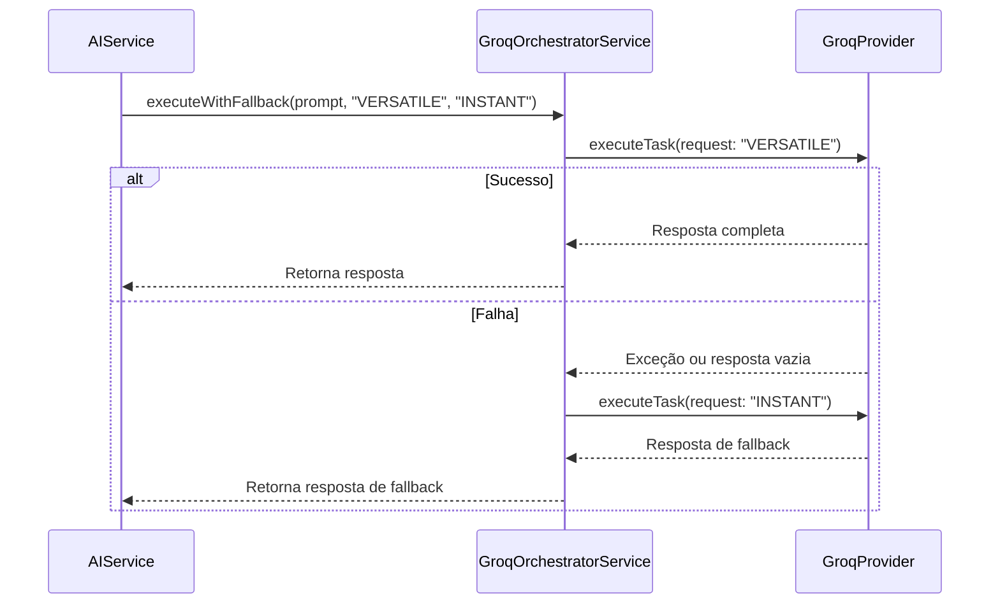

**Estratégia de Fallback:**
1. **Tentativa Inicial**: Executa com modelo preferencial (ex: VERSATILE)
2. **Detecção de Falha**: Verifica exceção ou resposta vazia/inválida
3. **Fallback Automático**: Executa automaticamente com modelo secundário (ex: INSTANT)
4. **Logging**: Registra tentativa inicial e fallback para monitoramento

**Benefícios:**
- **Alta Disponibilidade**: Continuidade mesmo com falha de modelo específico
- **Otimização Automática**: Usa modelo mais poderoso quando disponível, fallback para mais rápido
- **Transparência**: Logging detalhado para análise e debugging

### 7.5. Estratégias de Orquestração Global

O `AIOrchestratorService` implementa roteamento entre provedores:

- **Primary-Fallback**: Provedor primário com fallback automático para secundário
  - **Ollama** (padrão) → **Groq** (fallback se Ollama falhar)
- **Task-Based Routing**: Roteamento baseado em tipo de tarefa (multimodal → Ollama Vision, texto → Ollama/Groq)
- **Load-Aware Selection**: Seleção baseada em carga do sistema (futuro)
- **Cost Optimization**: Seleção considerando custo-benefício (futuro)
- **User Preference**: Respeita preferência do usuário (`preferredProvider` na requisição)

### 7.6. Salvamento no Banco de Dados e RAG

O sistema salva automaticamente todas as interações no banco de dados para habilitar RAG (Retrieval-Augmented Generation):

**Fluxo de Salvamento:**

1. **Criação de Sessão**: Cada análise cria uma `ChatSession` no banco
2. **Salvamento de Mensagens**: 
   - Mensagem do usuário (prompt + contexto) → `ChatMessage` com role "user"
   - Resposta do assistente → `ChatMessage` com role "assistant"
3. **Atualização de Perfil**: Histórico é usado para atualizar `UserProfileAI`
4. **Uso em RAG**: Histórico é consultado em futuras interações para contexto

**Benefícios:**
- **Contexto Persistente**: Sistema lembra de conversas anteriores
- **Melhoria Contínua**: Respostas melhoram com base no histórico
- **RAG**: Permite busca semântica em conversas anteriores
- **Análise**: Histórico completo para análise e métricas

**Tabelas Envolvidas:**
- `chat_session`: Sessões de conversa
- `chat_message`: Mensagens individuais (user/assistant)
- `user_profile_ai`: Perfil do usuário com histórico estruturado

**Implementação:**
- Endpoint `/v1/ai/document/analyze` salva automaticamente
- Outros endpoints de IA também salvam (ex: `/api/ai/analyze/generic`)
- Processo assíncrono para não bloquear resposta ao usuário

---

## 8. Agente de Conhecimento (Writer/Editor)

Diferente do modo "Chat" (conversacional), o MindForge possui um **Modo Agente** especializado na criação e edição de documentos (`KnowledgeItem`).

### 8.1. Fluxo de Edição Estruturada (Agent Mode)

O objetivo não é apenas conversar, mas **agir** sobre o conteúdo. O agente atua como um editor sênior que propõe alterações cirúrgicas.

**Características do Agente:**
- **Ativo vs Passivo**: Em vez de responder perguntas, ele propõe mudanças no texto.
- **Saída Estruturada**: Gera estritamente **JSON** contendo um "diff" das alterações.
- **Context-Aware**: Analisa a estrutura do documento para inserir conteúdo no local semanticamente correto.
- **Temperatura Baixa**: Opera com temperatura `0.3` para garantir obediência ao formato JSON.

### 8.2. Mecanismo de Diff (JSON Proposal)

O agente recebe o conteúdo atual e a instrução do usuário, e retorna uma proposta de modificação no seguinte formato:

```json
{
  "summary": "Adicionei uma seção sobre Streams API pois é fundamental para o tópico de Coleções.",
  "changes": [
    {
      "type": "ADD",
      "startLine": 45,
      "endLine": 45,
      "proposedContent": "### Streams API\nA Streams API permite processamento funcional...",
      "reason": "Expansão natural do tópico anterior"
    },
    {
      "type": "REPLACE",
      "startLine": 10,
      "endLine": 12,
      "originalContent": "Java é verboso.",
      "proposedContent": "Java moderna (17+) reduz a verbosidade com Records e var.",
      "reason": "Atualização técnica"
    }
  ]
}
```

### 8.3. Pipeline de Processamento (Back-end)

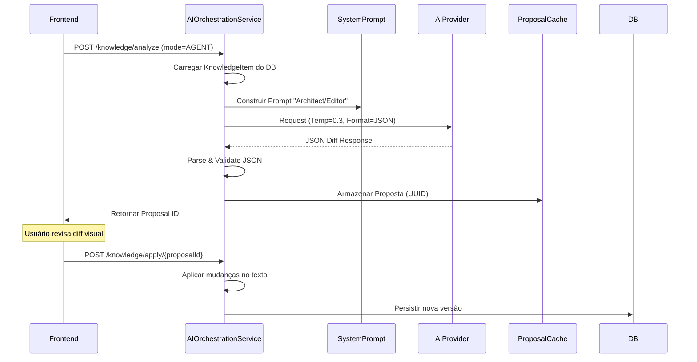

---

## 9. Conclusão


A arquitetura de IA do MindForge demonstra como princípios sólidos de engenharia de software podem ser aplicados para construir sistemas inteligentes, robustos e manuteníveis. As decisões de design—orquestração em Java, padrão Strategy, ciclo de memória assíncrono e múltiplos padrões de resiliência—resultam em um sistema que transcende a categoria de simples cliente de API.

O sistema representa uma plataforma que agrega valor real ao transformar modelos de linguagem genéricos em ferramentas de aprendizado contextuais e personalizadas, com a flexibilidade inerente para evoluir e se adaptar às mudanças no cenário de IA.

---

## Referências e Recursos

- [Resilience4j Documentation](https://resilience4j.readme.io/)
- [Spring Boot Async](https://docs.spring.io/spring-boot/docs/current/reference/html/features.html#features.task-execution-and-scheduling)
- [Groq API Documentation](https://console.groq.com/docs)
- [Ollama Documentation](https://ollama.ai/docs)
- [Prompt Engineering Guide](https://www.promptingguide.ai/)
