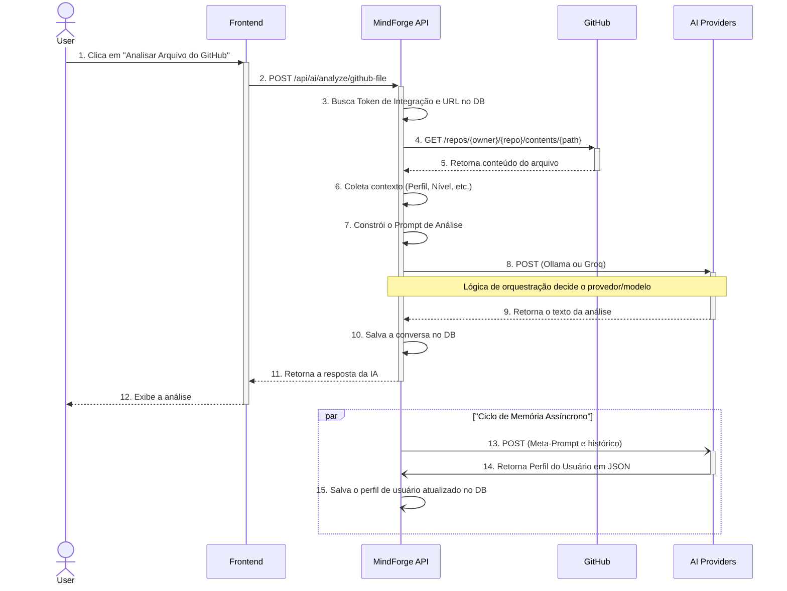
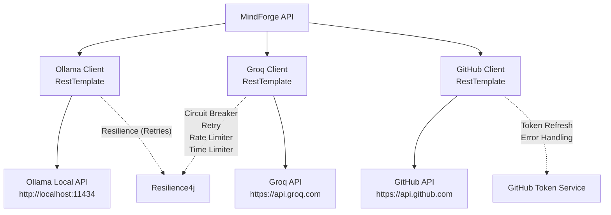
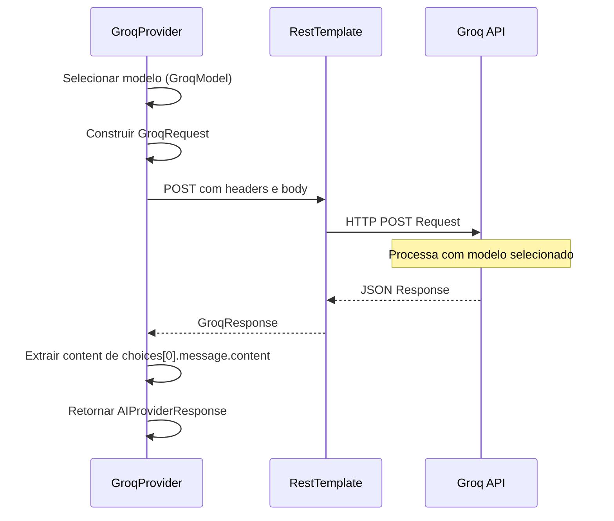
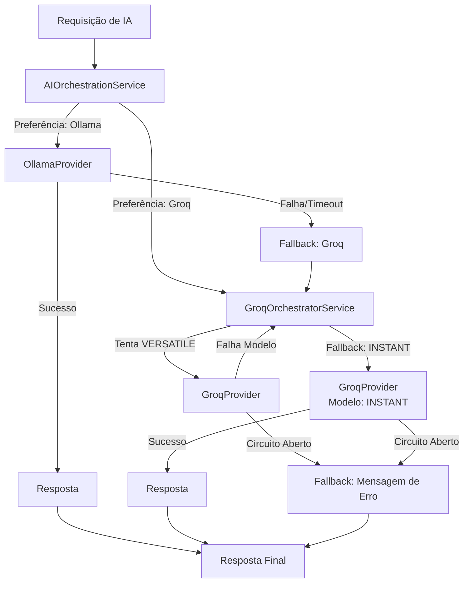
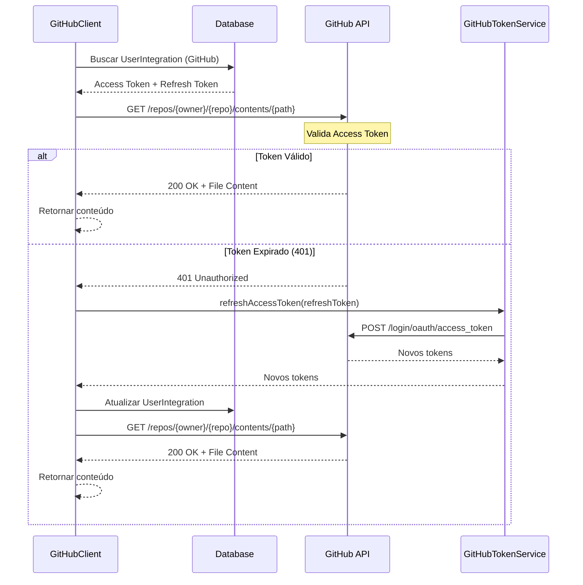
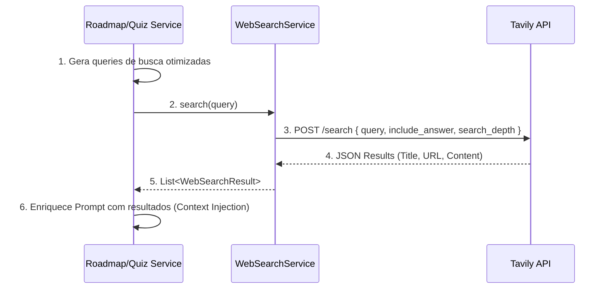
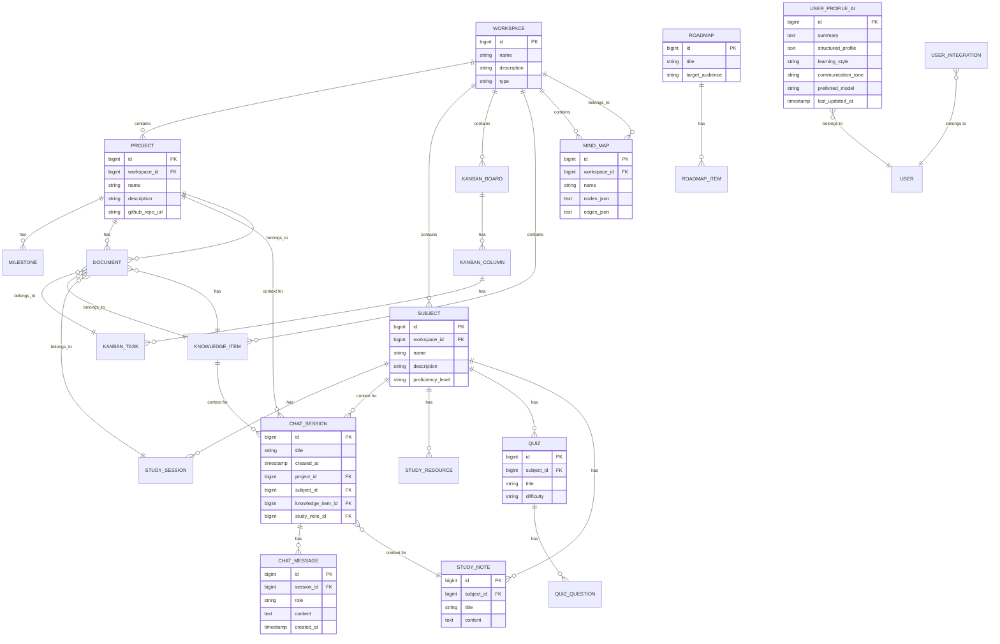

# Arquitetura Técnica Detalhada do MindForge

## Índice

1. [Filosofia e Princípios Arquiteturais](#1-filosofia-e-princípios-arquiteturais)
2. [System Design e Fluxo de Dados](#2-system-design-e-fluxo-de-dados)
3. [Padrão AI Provider e Orquestração](#3-padrão-ai-provider-e-orquestração)
4. [Engenharia de Prompt e Memória](#4-engenharia-de-prompt-e-memória)
5. [Bounded Contexts e Domínios de Negócio](#5-bounded-contexts-e-domínios-de-negócio)
6. [Arquitetura Multi-Tenant](#6-arquitetura-multi-tenant)
7. [Padrões de Design e Suas Necessidades Reais](#7-padrões-de-design-e-suas-necessidades-reais)
8. [Justificativas Tecnológicas e Trade-offs](#8-justificativas-tecnológicas-e-trade-offs)
9. [Conexões com APIs Externas e Integrações](#9-conexões-com-apis-externas-e-integrações)
10. [Modelagem de Dados e Esquema do Banco](#10-modelagem-de-dados-e-esquema-do-banco)
11. [Trade-offs Atuais](#11-trade-offs-atuais)
12. [Conclusão](#12-conclusão)

---

## 1. Filosofia e Princípios Arquiteturais

O MindForge foi concebido para ser mais do que uma API de CRUD tradicional. A visão é criar uma **plataforma de produtividade e aprendizado proativa e inteligente** que atua como um "segundo cérebro". Para alcançar essa visão, a arquitetura foi guiada por princípios fundamentais que equilibram velocidade de desenvolvimento, manutenibilidade e flexibilidade a longo prazo.

### 1.1. Separation of Concerns (SoC)

A lógica de negócio (gerenciamento de dados) é mantida estritamente separada da lógica de integração com IA. Mesmo dentro de um monólito, a camada de IA é desacoplada através de interfaces, garantindo:

- **Modularidade**: Código organizado em módulos claramente definidos
- **Testabilidade**: Facilidade para testar cada camada isoladamente
- **Manutenibilidade**: Mudanças em uma camada não afetam outras
- **Reusabilidade**: Componentes podem ser reutilizados em diferentes contextos

### 1.2. Pragmatismo sobre Dogma

A decisão de integrar IA diretamente na aplicação Java, em vez de usar um microserviço Python, foi uma escolha pragmática para o estágio atual do projeto. Esta decisão:

- **Reduz Complexidade**: Elimina necessidade de infraestrutura adicional
- **Acelera Desenvolvimento**: Reduz overhead de comunicação entre serviços
- **Mantém Flexibilidade**: Design interno (Padrão Strategy/Provider) permite evolução futura

**Trade-off Consciente**: Perda de acesso direto ao ecossistema Python de IA (LangChain, LlamaIndex), mitigada por implementação cuidadosa de padrões em Java.

### 1.3. Manutenibilidade e Evolução

O projeto é estruturado como um **Monólito Modular**:

- **Bounded Contexts**: Domínios de negócio bem definidos (`study`, `project`, etc.)
- **Pacotes Separados**: Cada domínio tem sua própria estrutura e responsabilidades
- **Clareza Estrutural**: Sistema fácil de entender e manter
- **Evolução Incremental**: Base sólida para futura extração para microserviços, se necessário

### 1.4. API-First Design

A API foi projetada para ser consumida por qualquer cliente (web, mobile, desktop):

- **Desacoplamento Frontend**: Frontend é aplicação separada que comunica via REST
- **Contratos Claros**: APIs bem definidas facilitam integração
- **Documentação Automática**: Swagger/OpenAPI para documentação interativa
- **Reutilização**: Mesma API serve múltiplos clientes

---

## 2. System Design e Fluxo de Dados

A arquitetura do MindForge é a de um **Monólito Modular** que orquestra chamadas para APIs externas. O diagrama abaixo ilustra o fluxo completo de dados do sistema: a análise de um arquivo do GitHub com o ciclo de memória.



### 2.1. Componentes Principais do Fluxo

1. **Recepção de Requisição**: Frontend envia requisição HTTP para API
2. **Coleta de Contexto**: Sistema busca dados relevantes (integração GitHub, perfil do usuário)
3. **Construção de Prompt**: Engenharia de prompt com contexto coletado
4. **Orquestração de IA**: Seleção dinâmica (Ollama para local/privacidade, Groq para velocidade/nuvem)
5. **Processamento de Resposta**: Validação e formatação da resposta
6. **Persistência**: Salvamento de conversa e contexto
7. **Ciclo de Memória**: Atualização assíncrona do perfil de aprendizado

---

## 3. Padrão AI Provider e Orquestração

Para evitar acoplamento forte com um único modelo de IA, foi implementado o **Padrão Strategy**. O `AIService` depende de uma interface `AIProvider`, e `OllamaProvider` e `GroqProvider` são implementações concretas.

### 3.1. Interface AIProvider

```java
public interface AIProvider {
    String executeTask(String prompt, Map<String, Object> context);
    boolean supportsTaskType(TaskType taskType);
    ProviderCapabilities getCapabilities();
}
```

### 3.2. Serviço de Orquestração

O **Nível Global**: `AIOrchestratorService` pode rotear entre provedores (Ollama → Groq) que permite ao sistema:

- **Seleção Inteligente**: Escolher o provedor/modelo mais adequado para a tarefa
- **Otimização de Recursos**: Usar modelo rápido para tarefas simples, modelo poderoso para análises complexas
- **Fallback Automático**: Implementar lógica de fallback quando modelo primário falha
- **Monitoramento**: Rastrear performance e disponibilidade de cada provedor

#### Suporte a Modo Agente (Knowledge Editor)
Para requisições de edição de conhecimento (`KnowledgeAIRequest`), o orquestrador altera seu fluxo padrão:
- **Bypass de Chat**: Ignora histórico de conversa (`ChatSession`) para focar no conteúdo do item.
- **System Prompt Rígido**: Instrui a geração exclusiva de JSON (Diff Format) para edição estruturada.
- **Output Parsing**: Valida e converte a resposta bruta da IA em objetos `KnowledgeAgentProposal`, garantindo segurança na aplicação de mudanças.

### 3.3. Benefícios da Abstração

- **Flexibilidade**: Troca de provedores sem impacto na lógica de negócio
- **Testabilidade**: Facilidade para mockar provedores em testes
- **Extensibilidade**: Adição de novos provedores com implementação mínima
- **Resiliência**: Isolamento de falhas de provedores específicos

---

## 4. Engenharia de Prompt e Memória

A "inteligência" do MindForge não vem exclusivamente do modelo de IA, mas da **orquestração e engenharia de prompt** realizadas pelo `AIService` em Java. O sistema atua como um "diretor de cena", usando técnicas avançadas para controlar o comportamento da IA.

### 4.1. Técnicas de Engenharia de Prompt

#### Atribuição de Persona
Instruções para a IA assumir papéis específicos:
- **"Aja como um Tech Recruiter experiente..."**
- **"Atue como um Mentor de Código didático..."**
- **"Responda como um Product Manager estratégico..."**

#### Injeção de Contexto
Enriquecimento do prompt com dados do sistema:
- Nível de proficiência do usuário em tópicos relevantes
- Perfil de aprendizado construído ao longo do tempo
- Histórico de interações anteriores
- Metadados contextuais da requisição

#### Instruções de Formato
Comandos explícitos para formato de saída:
- **"Retorne a análise em formato Markdown estruturado..."**
- **"Forneça o resultado em JSON com a seguinte estrutura..."**
- **"Organize o feedback em seções: Pontos Fortes, Melhorias, Sugestões..."**

### 4.2. O Módulo de Memória (MemoryService)

O `MemoryService` é o componente que eleva a IA do MindForge de uma ferramenta de "pergunta e resposta" para um **mentor que aprende e se adapta continuamente**.

#### Objetivo
Criar uma memória persistente sobre o perfil de aprendizado do usuário:
- Pontos fortes identificados
- Áreas de dificuldade detectadas
- Interesses e preferências
- Histórico de progresso

#### Impacto na Experiência do Usuário
- **Personalização Progressiva**: Respostas cada vez mais personalizadas
- **Continuidade Contextual**: Sensação de conversa contínua com mentor
- **Evolução Adaptativa**: Sistema se adapta ao perfil do usuário

#### Componentes

**UserProfileAI (Entidade)**
- Armazena "dossiê" da IA sobre o usuário
- Resumo textual do perfil
- JSON estruturado com dados detalhados
- Metadados (timestamps, versão, estatísticas)

**MemoryService (Serviço)**
- Orquestra o ciclo de memória
- Método `updateUserProfile` é **assíncrono (`@Async`)**
- Não impacta latência da resposta principal
- Executa em background thread separada

#### Fluxo do Ciclo de Memória (Meta-Análise)

1. **Trigger Assíncrono**: Após interação, `MemoryService` é chamado em background
2. **Coleta de Contexto**: Busca perfil atual e histórico de conversas
3. **Construção de Meta-Prompt**: Cria instrução para IA analisar a interação
4. **Execução de Meta-Análise**: Chama `AIProvider` com meta-prompt
5. **Processamento de Resposta**: Extrai perfil atualizado da resposta JSON
6. **Persistência**: Salva novo perfil na entidade `UserProfileAI`
7. **Enriquecimento Futuro**: Novo perfil enriquece contexto de próxima interação

#### Trade-offs
- **Chamada Extra**: Gera chamada adicional à API de IA (mitigada pelo `@Async`)
- **Dependência de Qualidade**: Eficácia depende da qualidade do meta-prompt
- **Consistência Eventual**: Aprendizado disponível apenas na próxima requisição
- **Custo**: Incremento no número de chamadas à API externa

---

## 5. Bounded Contexts e Domínios de Negócio

A API é organizada em **Bounded Contexts**, um conceito do Domain-Driven Design (DDD), onde cada domínio tem suas próprias responsabilidades, modelos e vocabulário.

### 5.1. Estrutura de Contextos

```
com.matheusdev.mindforge/
├── study/          # Contexto: Gestão de Estudos
├── project/        # Contexto: Gestão de Projetos
├── kanban/         # Contexto: Fluxo de Trabalho Kanban
├── knowledgeltem/  # Contexto: Base de Conhecimento
├── workspace/      # Contexto: Workspaces
├── document/       # Contexto: Gestão de Documentos
├── ai/             # Contexto: Orquestração de IA
├── integration/    # Integrações Externas
└── exception/      # Tratamento Global de Exceções
```

### 5.2. Study Context

**Responsabilidade**: Gerencia o progresso de aprendizado do usuário.

**Entidades Principais**:
- **`Subject`**: Assuntos de estudo (ex: Java, Spring Boot, DDD)
- **`StudySession`**: Sessões de estudo individual
- **`ProficiencyLevel`**: Níveis de proficiência por tópico

**Serviços**:
- `SubjectService`: Gerenciamento de assuntos
- `StudySessionService`: Rastreamento de sessões

### 5.3. Project Context

**Responsabilidade**: Gerencia o ciclo de vida de projetos.

**Entidades Principais**:
- **`Project`**: Projetos do usuário
- **`Milestone`**: Marcos e objetivos do projeto

**Serviços**:
- `ProjectService`: Gerenciamento de projetos
- `MilestoneService`: Gerenciamento de marcos

### 5.4. Kanban Context

**Responsabilidade**: Gerencia o fluxo de trabalho visual.

**Entidades Principais**:
- **`KanbanBoard`**: Quadros Kanban
- **`KanbanColumn`**: Colunas do quadro
- **`KanbanTask`**: Tarefas do quadro

**Serviços**:
- `KanbanService`: Gerenciamento de quadros e tarefas

### 5.5. Knowledge Context

**Responsabilidade**: Serve como "segundo cérebro" para anotações.

**Entidades Principais**:
- **`KnowledgeItem`**: Itens de conhecimento e anotações

**Serviços**:
- `KnowledgeItemService`: Gerenciamento de itens de conhecimento

### 5.6. Document Context

**Responsabilidade**: Abstrai o armazenamento de arquivos.

**Entidades Principais**:
- **`Document`**: Documentos e arquivos

**Serviços**:
- `DocumentService`: Upload, download e gerenciamento de documentos

### 5.7. AI & Integration Context

**Responsabilidade**: Orquestra toda a inteligência e comunicação externa.

**Entidades Principais**:
- **`ChatSession`**: Sessões de conversa com IA
- **`UserProfileAI`**: Perfil de aprendizado construído pela IA
- **`UserIntegration`**: Integrações externas (GitHub, etc.)

**Serviços**:
- `AIService`: Orquestração principal de IA
- `MemoryService`: Gestão de memória e perfil
- `AIContextService`: Coleta de contexto
- `PromptBuilderService`: Construção de prompts
- `GitHubIntegrationService`: Integração com GitHub

---


---

## 6. Arquitetura Multi-Tenant

O MindForge suporta múltiplos inquilinos (tenants) através de uma arquitetura de banco de dados compartilhado com isolamento lógico (Shared Database, Shared Schema).

### 6.1. Modelo de Isolamento
Utilizamos a abordagem de **Discriminator Column**. Todas as tabelas sensíveis ao inquilino possuem uma coluna `tenant_id` (chave estrangeira para a tabela `tenants`).

- **Isolamento de Dados**: Garante que o Usuário A do Tenant X não acesse dados do Tenant Y.
- **Eficiência**: Simplifica a infraestrutura (um único banco de dados, migrações unificadas).

### 6.2. Resolução de Tenant
O tenant é identificado a cada requisição HTTP através do Token JWT.

1. **Authentication**: O usuário faz login e recebe um JWT.
2. **Token claim**: O JWT contém o claim `tenantId`.
3. **TenantFilter**: Um filtro intercepta a requisição, extrai o `tenantId` e o armazena no `TenantContext` (ThreadLocal).

### 6.3. Aplicação Automática (TenantEntityListener)
Para garantir que todo dado criado seja associado ao tenant correto sem repetição de código, utilizamos JPA Entity Listeners.

```java
@PrePersist
public void setTenant(Object entity) {
    Long tenantId = TenantContext.getTenantId();
    if (tenantId != null && entity.getTenant() == null) {
        entity.setTenant(new Tenant(tenantId));
    }
}
```

Isso blinda a camada de serviço de ter que setar manualmente o tenant em cada operação de escrita.

---

## 7. Padrões de Design e Suas Necessidades Reais

A arquitetura do MindForge não foi construída seguindo padrões "porque sim" ou para demonstrar conhecimento teórico. Cada padrão implementado resolve um **problema concreto** que surgiu das necessidades do domínio de IA e produtividade. Esta seção explica as decisões arquiteturais baseadas em necessidades reais.

### 6.1. Strategy Pattern (AIProvider)

**Problema Real**: O projeto precisa integrar múltiplos provedores de IA (Ollama local, Groq cloud) e potencialmente adicionar mais no futuro (OpenAI, Anthropic). Cada provedor tem:
- APIs diferentes (endpoints, formatos de request/response)
- Características distintas (latência, custo, capacidade)
- Casos de uso específicos (privacidade vs performance)

**Solução Ingênua (Descartada)**:
```java
public String callAI(String prompt) {
    if (useOllama) {
        // Código específico Ollama
    } else if (useGroq) {
        // Código específico Groq
    }
    // Adicionar novo provedor = modificar este método
}
```

**Problemas da Solução Ingênua**:
- Violação do Open/Closed Principle (modificar código existente para adicionar provedor)
- Lógica de negócio acoplada a detalhes de implementação
- Impossível testar provedores isoladamente
- Código cresce exponencialmente com cada novo provedor

**Solução Implementada (Strategy Pattern)**:
```java
public interface AIProvider {
    AIProviderResponse executeTask(AIProviderRequest request);
}

// Implementações concretas
public class OllamaProvider implements AIProvider { ... }
public class GroqProvider implements AIProvider { ... }

// Orquestrador decide qual usar
public class AIOrchestrationService {
    public AIProviderResponse execute(AIRequest request) {
        AIProvider provider = selectProvider(request);
        return provider.executeTask(request);
    }
}
```

**Benefícios Concretos**:
- ✅ Adicionar novo provedor = criar nova classe (sem modificar código existente)
- ✅ Trocar de Ollama para Groq = mudar configuração (zero código)
- ✅ Testar com mock provider = injetar implementação fake
- ✅ Fallback automático = tentar provider alternativo sem duplicar lógica

**Por Que Era Necessário**: O sistema **precisa** de flexibilidade para:
1. Usar Ollama quando disponível (zero custo, privacidade)
2. Fazer fallback para Groq quando Ollama falha
3. Adicionar OpenAI/Anthropic no futuro sem refatoração massiva

---

### 6.2. Factory Pattern (Provider Selection)

**Problema Real**: Cada orquestrador precisa **criar/obter** a instância correta de `AIProvider` baseado em uma string (nome do provedor). Não podemos instanciar diretamente porque:
- Provedores são gerenciados pelo Spring (injeção de dependência)
- Seleção é dinâmica (runtime, não compile-time)
- Múltiplos orquestradores precisam da mesma lógica de seleção

**Solução Ingênua (Descartada)**:
```java
public AIProvider selectProvider(String name) {
    if (name.equals("ollamaProvider")) {
        return new OllamaProvider(restTemplate, config); // Quebra DI
    } else if (name.equals("groqProvider")) {
        return new GroqProvider(restTemplate, config); // Quebra DI
    }
    // Adicionar provedor = modificar este método
}
```

**Problemas da Solução Ingênua**:
- Quebra injeção de dependência do Spring
- Duplicação de lógica em cada orquestrador
- Impossível mockar provedores em testes
- Violação do DRY (Don't Repeat Yourself)

**Solução Implementada (Factory Pattern com Spring)**:
```java
@Service
public class ExecutionStep {
    // Spring injeta TODOS os providers em um Map
    private final Map<String, AIProvider> aiProviders;
    
    // Factory Method: retorna provider baseado no nome
    private AIProvider getProvider(String providerName) {
        AIProvider provider = aiProviders.get(providerName);
        if (provider == null) {
            throw new IllegalArgumentException("Provedor desconhecido: " + providerName);
        }
        return provider;
    }
    
    // Uso
    public void execute() {
        AIProvider provider = getProvider("ollamaProvider");
        provider.executeTask(request);
    }
}
```

**Como Spring Popula o Map**:
```java
// Spring detecta todas as implementações de AIProvider
// e injeta em um Map<String, AIProvider> onde:
// - Key = nome do bean ("ollamaProvider", "groqProvider")
// - Value = instância gerenciada pelo Spring

Map<String, AIProvider> aiProviders = {
    "ollamaProvider" -> OllamaProvider@123,
    "groqProvider" -> GroqProvider@456
}
```

**Benefícios Concretos**:
- ✅ Adicionar novo provedor = criar classe + anotar com `@Service` (zero mudança em orquestradores)
- ✅ Spring gerencia ciclo de vida (injeção de dependências, configuração)
- ✅ Lógica centralizada (DRY - não duplicar em cada orquestrador)
- ✅ Testável (mockar Map de providers)
- ✅ Type-safe (compilador garante que key existe)

**Por Que Era Necessário**: O sistema tem **7+ orquestradores** (ChatOrchestrator, DocumentAnalysisOrchestrator, QuizGeneratorService, etc.) e **todos** precisam selecionar providers dinamicamente. Sem Factory Pattern:
- Duplicação de lógica de seleção em 7+ lugares
- Impossível garantir consistência
- Adicionar provedor = modificar 7+ arquivos

**Padrão Complementar**: Factory trabalha **junto** com Strategy. Strategy define a interface (`AIProvider`), Factory cria/seleciona a implementação correta.

---

### 6.3. Chain of Responsibility (Prompt Building)

**Problema Real**: Construir um prompt efetivo para IA requer **múltiplas etapas sequenciais**:
1. Definir persona (Mentor, Analyst, Recruiter)
2. Injetar contexto do usuário (perfil de aprendizado)
3. Adicionar dados do domínio (nível de proficiência, histórico)
4. Formatar instruções específicas da tarefa
5. Adicionar constraints de formato de saída

**Solução Ingênua (Descartada)**:
```java
public String buildPrompt(Request req) {
    String prompt = "Você é um " + persona + "\n";
    prompt += "Usuário tem perfil: " + profile + "\n";
    prompt += "Nível: " + level + "\n";
    // ... 50+ linhas de concatenação
    return prompt;
}
```

**Problemas da Solução Ingênua**:
- Método gigante (200+ linhas) impossível de manter
- Lógica de diferentes responsabilidades misturada
- Impossível reutilizar etapas em diferentes contextos
- Difícil testar etapas isoladamente

**Solução Implementada (Chain of Responsibility)**:
```java
public interface PromptBuildingStep {
    void process(PromptContext context);
}

// Etapas específicas
public class PersonaInjectionStep implements PromptBuildingStep { ... }
public class UserProfileStep implements PromptBuildingStep { ... }
public class DomainContextStep implements PromptBuildingStep { ... }

// Pipeline configurável
public class PromptBuilder {
    private List<PromptBuildingStep> steps;
    
    public String build(PromptContext context) {
        for (PromptBuildingStep step : steps) {
            step.process(context);
        }
        return context.getFinalPrompt();
    }
}
```

**Benefícios Concretos**:
- ✅ Cada etapa tem responsabilidade única (fácil de entender)
- ✅ Reutilizar etapas em diferentes pipelines (ex: Mentor e Analyst compartilham UserProfileStep)
- ✅ Testar cada etapa isoladamente
- ✅ Adicionar/remover etapas sem afetar outras

**Por Que Era Necessário**: Prompts de IA são **complexos e contextuais**. Um prompt para análise de código precisa de:
- Persona técnica + perfil do usuário + nível de proficiência + código + instruções de formato
- Prompt para quiz precisa de: Persona educacional + perfil + histórico de notas + instruções JSON

Sem modularização, teríamos duplicação massiva ou métodos gigantes.

---

### 6.4. Repository Pattern (Acesso a Dados)

**Problema Real**: A lógica de negócio não deve depender de detalhes de persistência (SQL, NoSQL, cache). Precisamos:
- Trocar banco de dados sem reescrever serviços
- Adicionar cache transparentemente
- Testar serviços sem banco real

**Solução Implementada**:
```java
public interface SubjectRepository extends JpaRepository<Subject, Long> {
    List<Subject> findByWorkspaceId(Long workspaceId);
    Optional<Subject> findByIdAndWorkspaceId(Long id, Long workspaceId);
}

// Serviço depende da interface, não da implementação
public class SubjectService {
    private final SubjectRepository repository;
    
    public Subject findById(Long id) {
        return repository.findById(id)
            .orElseThrow(() -> new NotFoundException("Subject not found"));
    }
}
```

**Benefícios Concretos**:
- ✅ Trocar de PostgreSQL para MongoDB = implementar nova interface (serviços intocados)
- ✅ Adicionar cache = decorar repository com cache layer
- ✅ Testar serviços = mockar repository (sem banco)

**Por Que Era Necessário**: O projeto está em evolução. Hoje usa PostgreSQL, mas pode precisar de:
- Cache Redis para performance
- Elasticsearch para busca semântica (RAG)
- Vector database para embeddings

Repository Pattern permite essas mudanças sem reescrever toda a lógica de negócio.

---

### 6.5. Async/Background Processing (Ciclo de Memória)

**Problema Real**: Atualizar o perfil de aprendizado do usuário requer:
1. Buscar histórico de conversas
2. Chamar IA para meta-análise (pode levar 5-10 segundos)
3. Salvar perfil atualizado

Se feito **sincronamente**, o usuário esperaria 10+ segundos por uma resposta.

**Solução Implementada**:
```java
@Async
public void updateUserProfile(Long userId, ChatMessage newMessage) {
    // Executa em thread separada
    UserProfileAI currentProfile = profileRepository.findByUserId(userId);
    String metaPrompt = buildMetaPrompt(currentProfile, newMessage);
    
    AIProviderResponse analysis = aiProvider.executeTask(metaPrompt);
    UserProfileAI updatedProfile = parseProfile(analysis);
    
    profileRepository.save(updatedProfile);
}
```

**Benefícios Concretos**:
- ✅ Usuário recebe resposta imediatamente (latência < 2s)
- ✅ Sistema aprende em background (sem impacto na UX)
- ✅ Perfil atualizado disponível na próxima interação

**Por Que Era Necessário**: A experiência do usuário é **crítica**. Esperar 10s por resposta é inaceitável. Mas o sistema **precisa** aprender continuamente para personalizar respostas. Async resolve esse conflito.

---

### 6.6. Circuit Breaker + Retry (Resiliência)

**Problema Real**: APIs externas (Ollama, Groq, GitHub) podem:
- Falhar temporariamente (timeout de rede)
- Ficar indisponíveis (servidor down)
- Responder lentamente (sobrecarga)

**Solução Ingênua (Descartada)**:
```java
public String callAPI() {
    try {
        return httpClient.post(url, body);
    } catch (Exception e) {
        return "Erro: tente novamente";
    }
}
```

**Problemas da Solução Ingênua**:
- Falha transitória (1 timeout) = erro para usuário
- API down = sistema tenta infinitamente (threads bloqueadas)
- Sem feedback sobre saúde do sistema

**Solução Implementada (Resilience4j)**:
```java
@CircuitBreaker(name = "aiProvider", fallbackMethod = "fallback")
@Retry(name = "aiProvider")
@RateLimiter(name = "aiProvider")
public AIProviderResponse callGroq(Request req) {
    return restTemplate.postForObject(groqUrl, req, Response.class);
}

public AIProviderResponse fallback(Request req, Exception e) {
    // Tenta Ollama como fallback
    return ollamaProvider.executeTask(req);
}
```

**Benefícios Concretos**:
- ✅ Timeout transitório = retry automático (3 tentativas)
- ✅ Groq down = circuit breaker abre, fallback para Ollama
- ✅ Sistema não trava threads esperando API morta
- ✅ Métricas de saúde disponíveis (taxa de falha, latência)

**Por Que Era Necessário**: Sistemas de IA dependem de **múltiplos serviços externos**. Sem resiliência:
- 1 falha de rede = usuário vê erro
- Ollama travado = aplicação inteira trava
- API rate limit = sistema para de funcionar

---

### 6.7. DTO Pattern (Separação de Camadas)

**Problema Real**: Entidades JPA não devem ser expostas diretamente na API porque:
- Contêm anotações de persistência (poluição de responsabilidades)
- Podem ter lazy loading (erros de serialização JSON)
- Mudanças no banco afetam contratos da API

**Solução Implementada**:
```java
// Entidade (camada de persistência)
@Entity
public class Subject {
    @Id private Long id;
    @ManyToOne(fetch = LAZY) private Workspace workspace;
    @OneToMany(mappedBy = "subject") private List<StudySession> sessions;
}

// DTO (camada de API)
public record SubjectDTO(
    Long id,
    String name,
    String proficiencyLevel,
    List<StudySessionDTO> sessions
) {}

// Conversão
public SubjectDTO toDTO(Subject entity) {
    return new SubjectDTO(
        entity.getId(),
        entity.getName(),
        entity.getProficiencyLevel().name(),
        entity.getSessions().stream().map(this::toDTO).toList()
    );
}
```

**Benefícios Concretos**:
- ✅ API estável mesmo com mudanças no banco
- ✅ Controle total sobre o que é exposto (segurança)
- ✅ Sem problemas de lazy loading em JSON

**Por Que Era Necessário**: Frontend e backend evoluem independentemente. Expor entidades JPA diretamente = acoplamento forte entre camadas.

---

### 6.7. Facade Pattern (AI Orchestrator)

**Problema Real**: O sistema possui **7+ orquestradores especializados** (Chat, Document, Quiz, Roadmap, etc.), cada um com complexidade interna. Os controllers (API layer) não devem conhecer essa complexidade.

**Solução Ingênua (Descartada)**: Injetar todos os 7 orquestradores em cada Controller ou ter controllers gigantes gerenciando lógica de roteamento.

**Solução Implementada**:
```java
@Service
public class AIOrchestrationService {
    // Fachada única para todos os serviços de IA
    private final ChatOrchestrator chat;
    private final DocumentOrchestrator doc;
    private final QuizGenerator quiz;
    
    // Método simples exposto para o cliente
    public Response handleChat(Request req) {
        return chat.execute(req); // Delega para o especialista
    }
}
```

**Benefícios Concretos**:
- ✅ API limpa: Controllers só conhecem **um** serviço de entrada.
- ✅ Baixo acoplamento: Mudanças internas nos orquestradores não quebram a API.
- ✅ Ponto único de entrada: Facilita logging centralizado e tratamentos globais.

---

### 6.8. Command Pattern (AI Processing Steps)

**Problema Real**: Pipeline de processamento de IA (Validação -> Contexto -> Prompt -> Execução -> Auditoria) precisa ser flexível e testável.

**Solução Implementada**: A interface `AIProcessingStep` atua como um **Command**:
```java
public interface AIProcessingStep {
    CompletableFuture<AIContext> execute(AIContext context);
}
```

Cada passo (`ValidationStep`, `PromptBuildingStep`) é um comando encapsulado. O `ChatOrchestrator` apenas invoca a sequência de comandos.

**Benefícios Concretos**:
- ✅ SRP: Cada passo faz apenas uma coisa.
- ✅ Testabilidade: Testar `ValidationStep` isolado do resto.
- ✅ Reordenação: Mudar a ordem dos passos é trivial.

---

### 6.9. Ports & Adapters (Hexagonal Architecture)

**Observação**: Embora o projeto seja um monólito modular, a camada de integração de IA segue estritamente **Ports & Adapters**.

- **Port (Porta)**: Interface `AIProvider` (define o contrato que o domínio precisa).
- **Adapters (Adaptadores)**: `OllamaProvider` e `GroqProvider` (implementam a conexão com o mundo externo).

**Benefício Real**: Isso blinda o "Core Domain" (lógica de orquestração e prompt) contra mudanças nas APIs externas. Se a API do Groq mudar, apenas o `GroqProvider` (o adaptador) muda; o domínio permanece intacto.

---

### 6.10. Resumo: Padrões vs Necessidades

| Padrão | Problema Real Resolvido | Alternativa Ingênua | Custo de Não Usar |
|--------|------------------------|---------------------|-------------------|
| **Strategy** | Múltiplos provedores de IA | If/else gigante | Código rígido, impossível adicionar provedores |
| **Factory** | Seleção dinâmica de providers | If/else em cada orquestrador | Duplicação em 7+ lugares, quebra DI |
| **Facade** | 7+ services de IA complexos | Injetar 7 services no Controller | Controller gordo, alto acoplamento |
| **Command** | Pipeline de IA complexo (steps) | Código procedural gigante | Difícil testar steps isolados |
| **Adapter** | Blindagem contra APIs externas | Código acoplado à lib externa | Mudança no Groq quebra Core Domain |
| **Chain of Responsibility** | Prompts complexos e modulares | Método de 200+ linhas | Duplicação massiva, manutenção impossível |
| **Repository** | Abstração de persistência | SQL direto nos serviços | Impossível trocar banco ou adicionar cache |
| **Async** | Aprendizado sem latência | Processamento síncrono | UX ruim (10s de espera) |
| **Circuit Breaker** | APIs externas instáveis | Try/catch simples | Sistema trava com APIs down |
| **DTO** | Separação API/Persistência | Expor entidades JPA | Acoplamento forte, bugs de serialização |

**Conclusão**: Cada padrão foi escolhido para resolver um **problema específico** do domínio de IA e produtividade. Não é over-engineering, é engenharia pragmática para um sistema que precisa ser **flexível, resiliente e escalável**.

---

## 8. Justificativas Tecnológicas e Trade-offs

### 7.1. Escolha da Stack Java/Spring Boot

**Tecnologias**:
- **Java 21**: Recursos modernos (Records, Pattern Matching, Virtual Threads)
- **Spring Boot 3.3.5**: Framework enterprise maduro e produtivo
- **Spring Framework 6.1**: Ecossistema robusto e extensivo

**Justificativa**:
- **Robustez**: Ecossistema maduro e amplamente testado
- **Produtividade**: Ferramentas e convenções que aceleram desenvolvimento
- **Comunidade**: Grande comunidade e ecossistema de bibliotecas
- **Performance**: Runtime otimizado com JIT compiler

**Trade-offs**:
- **Complexidade Inicial**: Curva de aprendizado mais íngreme
- **Overhead**: Maior consumo de memória comparado a frameworks mais leves
- **Velocidade de Startup**: Mais lento que alternativas minimalistas

### 7.2. Escolha do Padrão AI Provider (Monólito)

**Decisão**: Integrar IA diretamente na aplicação Java.

**Justificativa**:
- **Simplicidade Operacional**: Reduz complexidade de infraestrutura
- **Latência**: Comunicação in-process elimina overhead de rede
- **Coesão de Dados**: Acesso direto a serviços de domínio e banco de dados

**Trade-offs**:
- **Escalabilidade**: Limitada pela capacidade de uma única instância
- **Ecossistema Python**: Perda de acesso a bibliotecas especializadas (LangChain, LlamaIndex)
- **Processamento de IA**: Processamento CPU-intensivo pode competir com lógica de negócio

### 7.3. Escolha dos Modelos de IA (Multi-Provider)

**Provedores**:
- **Groq**: Infraestrutura de IA de alta performance

**Justificativa**:
- **Ollama Vision**: Suporte local experimental para multimodalidade (Llava/Qwen-VL)
- **Groq Vision**: Suporte futuro para multimodalidade de alta performance

**Groq**:
- Foco em alta velocidade (tokens/segundo)
- Modelos open-source de baixa latência
- Ideal para interações que exigem resposta rápida

**Arquitetura de Provedores**:
- Permite uso otimizado de cada provedor
- Otimização de custo, velocidade e capacidade
- Adaptação a diferentes tipos de tarefas

**Trade-offs**:
- **Complexidade**: Aumento na lógica de orquestração
- **Gerenciamento**: Necessidade de gerenciar múltiplas chaves de API
- **Contratos**: Diferentes provedores têm contratos distintos

### 7.4. Frontend Desacoplado (API-First)

**Decisão**: API projetada para ser consumida por qualquer cliente.

**Justificativa**:
- **Flexibilidade Tecnológica**: Frontend pode usar qualquer stack (React, Vue, Angular, Mobile)
- **Reutilização**: Mesma API serve múltiplos clientes
- **Evolução Independente**: Frontend e backend podem evoluir separadamente

**Trade-offs**:
- **Desenvolvimento Separado**: Requer construção de aplicação frontend separada
- **Overhead de Comunicação**: Necessidade de serialização/deserialização HTTP
- **CORS e Segurança**: Requer configuração adequada para acesso cross-origin

### 7.5. Persistência: PostgreSQL + JPA/Hibernate

**Justificativa**:
- **SQL Relacional**: Banco de dados relacional maduro e confiável
- **ORM Produtivo**: JPA/Hibernate reduz boilerplate
- **Migrações**: Hibernate auto-DDL facilita desenvolvimento

**Trade-offs**:
- **Flexibilidade**: Menos flexível que NoSQL para casos não-relacionais
- **Performance**: Overhead do ORM em comparação com SQL direto
- **Complexidade**: Curva de aprendizado para otimização de queries

---

## 9. Conexões com APIs Externas e Integrações

O MindForge integra-se com múltiplas APIs externas para fornecer funcionalidades avançadas. Cada integração implementa padrões de resiliência e tratamento de erros adequados.

### 8.1. Arquitetura de Integrações




### 8.2. Integração com Groq API

**Propósito**: Múltiplos modelos/agentes especializados, baixa latência.

**Cliente HTTP**: `RestTemplate` (Spring Framework)

**Endpoint**: Configurável via `groq.api.url` (padrão: `https://api.groq.com/openai/v1/chat/completions`)

**Autenticação**: Bearer Token via header (`Authorization: Bearer {apiKey}`)

**Características**:
- **6 Modelos Disponíveis**: VERSATILE, INSTANT, GPT_OSS, QWEN, SCOUT, MAVERICK
- **Headers**: `Content-Type: application/json`, `Authorization: Bearer {apiKey}`
- **Request Body**: `GroqRequest` com `model`, `messages`, `max_tokens`, `reasoning_effort`
- **Response Body**: `GroqResponse` com lista de `Choice` e `Message`

**Fluxo de Requisição**:


### 7.3.1. Fallback Strategy

**Implementação**: Lógica de orquestração no `GroqOrchestratorService` e métodos de fallback em cada provider.

**Comportamento**:
- **Nível de Provider**: Cada `AIProvider` implementa método `fallback()` chamado quando Circuit Breaker abre
- **Nível de Orquestração**: `GroqOrchestratorService` implementa fallback entre modelos (VERSATILE → INSTANT)



**Orquestração com Fallback**:
O `GroqOrchestratorService` implementa fallback automático entre modelos:
1. Tenta com modelo preferencial (ex: VERSATILE)
2. Se falhar, tenta automaticamente com modelo de fallback (ex: INSTANT)
3. Logging detalhado para monitoramento

**Resiliência**:
- Circuit Breaker (50% failure rate)
- Retry (3 tentativas, 500ms entre tentativas)
- Rate Limiter (10 chamadas/segundo)
- Time Limiter (5 segundos timeout)
- Fallback method implementado

### 8.3. Integração com GitHub API

**Propósito**: Buscar conteúdo de arquivos de repositórios para análise de código.

**Cliente HTTP**: `RestTemplate` (Spring Framework)

**Endpoint**: `https://api.github.com/repos/{owner}/{repo}/contents/{path}`

**Autenticação**: Bearer Token via header (`Authorization: Bearer {accessToken}`)

**Características**:
- **OAuth 2.0**: Integração via tokens de acesso e refresh
- **Token Refresh**: Atualização automática de tokens expirados
- **Headers**: `Authorization: Bearer {token}`, `Accept: application/vnd.github.v3.raw`
- **Response**: Conteúdo do arquivo como texto plano

**Fluxo de Requisição com Refresh Token**:


**Segurança**:
- Tokens armazenados de forma segura no banco de dados
- Refresh automático de tokens expirados
- Tratamento de erros de autenticação robusto

### 8.4. Integração com Web Research API (Tavily/RAG)

**Propósito**: Realizar pesquisas na web em tempo real para enriquecer a base de conhecimento da IA e reduzir alucinações (search grounding).

**Serviço**: `WebSearchService` (abstração interna)
**Provedor**: Tavily AI (`TavilyWebSearchEngine`)

**Fluxo de Utilização**:
Utilizado principalmente nos serviços de geração de conteúdo estruturado (`QuizService`, `RoadmapGeneratorService`) para garantir atualidade.



**Configuração**:
- **API Key**: Injetada via `@Value("${tavily.api.key}")`
- **Engine**: Implementação via `langchain4j-web-search-tavily`

**Casos de Uso**:
- **Roadmaps**: Busca cursos, tutoriais e documentação oficial atualizada.
- **Quizzes**: Valida fatos e busca exemplos recentes para perguntas.

### 8.5. Configuração de RestTemplate

O projeto utiliza `RestTemplate` para todas as chamadas HTTP externas:

**Configuração Atual**:
- Bean global configurado em `AIProviderConfig`
- Timeouts HTTP configurados adequadamente

**Características**:
- **Serialização**: JSON automático via Jackson
- **Error Handling**: Exceções HTTP tratadas localmente com logs detalhados
- **Timeouts HTTP**:
  - Connect Timeout: 5 segundos
  - Read Timeout: 180 segundos (permite tempo suficiente para Ollama processar)

**Configuração em `AIProviderConfig.java`**:
```java
@Bean
public RestTemplate restTemplate(RestTemplateBuilder builder) {
    return builder
            .setConnectTimeout(Duration.ofSeconds(5))
            .setReadTimeout(Duration.ofSeconds(180))
            .build();
}
```

**Timeouts de Requisições Assíncronas**:
- Spring MVC Async Request Timeout: 200 segundos
- Configurado em `application.properties`: `spring.mvc.async.request-timeout=200000`

**Recomendações Futuras**:
- Implementar interceptors para logging
- Considerar migração para WebClient (reativo)

---

## 10. Modelagem de Dados e Esquema do Banco

O MindForge utiliza **PostgreSQL** como banco de dados relacional, com mapeamento objeto-relacional via **JPA/Hibernate**.

### 9.1. Diagrama de Entidade-Relacionamento (ER)



### 9.2. Entidades Principais e Relacionamentos

#### Workspace (Raiz de Agregação)
- **Relacionamentos**:
  - `OneToMany` com `Project`
  - `OneToMany` com `Subject`
  - `OneToMany` com `KanbanBoard`
  - `OneToMany` com `KnowledgeItem`

#### Project
- **Relacionamentos**:
  - `ManyToOne` com `Workspace`
  - `OneToMany` com `Milestone`
  - `OneToMany` com `Document`
  - `OneToMany` com `ChatSession` (contexto)

#### Subject
- **Relacionamentos**:
  - `ManyToOne` com `Workspace`
  - `OneToMany` com `StudySession`
  - `OneToMany` com `ChatSession` (contexto)

#### ChatSession
- **Relacionamentos**:
  - `OneToMany` com `ChatMessage`
  - `ManyToOne` com `Project` (opcional - contexto)
  - `ManyToOne` com `Subject` (opcional - contexto)

#### UserProfileAI
- **Armazena**: Perfil de aprendizado do usuário construído pela IA
- **Campos Especiais**:
  - `summary`: Texto em linguagem natural
  - `structuredProfile`: JSON com dados estruturados
  - `learningStyle`: Enum (PRACTICAL, THEORETICAL, etc.)
  - `communicationTone`: Enum (ENCOURAGING, DIRECT, etc.)
  - `preferredModel`: Modelo de IA preferido do usuário

### 9.3. Estratégias de Persistência

**Fetch Types**:
- **LAZY**: Relacionamentos `@ManyToOne` e `@OneToMany` por padrão
- **EAGER**: Não utilizado (evita N+1 queries)

**Cascading**:
- **CascadeType.ALL**: Relacionamentos pai-filho (ex: `Project` → `Milestone`)
- **orphanRemoval**: Habilitado para relacionamentos de dependência

**Timestamps**:
- **@PrePersist**: Define `createdAt` automaticamente
- **@PreUpdate**: Atualiza `lastUpdatedAt` automaticamente

**Geração de IDs**:
- **@GeneratedValue(strategy = GenerationType.IDENTITY)**: IDs auto-incrementais

### 9.4. Tratamento de Dados

#### Validação de Entrada
- **Bean Validation**: Anotações `@NotNull`, `@NotEmpty`, `@Size` nas entidades
- **Camada de Serviço**: Validação de regras de negócio
- **Tratamento Global**: `RestExceptionHandler` centraliza tratamento de erros

#### Transformação de Dados
- **MapStruct**: Mapeamento type-safe entre Entidades e DTOs
- **DTOs**: Separação entre modelo de domínio e representação da API
- **Serialização**: Jackson para JSON automático

#### Cache
- **Caffeine Cache**: Cache em memória para consultas frequentes
- **Configuração**: TTL e tamanho configuráveis
- **Invalidação**: Cache invalidado em operações de escrita

---

## 11. Conclusão

Este documento serve como um guia abrangente para a arquitetura do MindForge, detalhando suas escolhas de design, fluxos de dados, padrões implementados e o caminho para sua evolução.

A arquitetura do MindForge demonstra como princípios sólidos de engenharia de software podem ser aplicados para construir sistemas inteligentes, robustos e manuteníveis que agregam valor real aos usuários.

---

## Referências

- [Spring Boot Documentation](https://spring.io/projects/spring-boot)
- [Domain-Driven Design](https://martinfowler.com/bliki/DomainDrivenDesign.html)
- [Pattern: Monolithic Architecture](https://martinfowler.com/articles/microservices.html)
- [Resilience4j Documentation](https://resilience4j.readme.io/)
